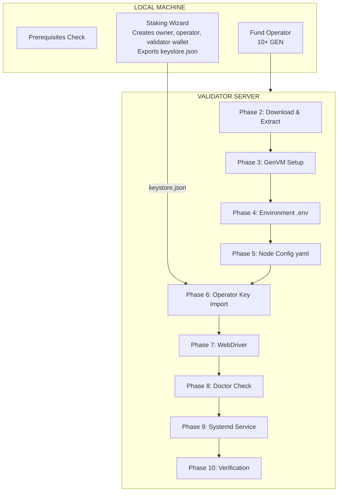

# GenLayer Validator Node Installation Procedure

## Goal
Install a GenLayer validator node from scratch on a Linux server, ready to sync and validate.

## Process Overview



## Prerequisites

Before starting, ensure:
- **Architecture**: AMD64 (x86_64) - check with `uname -m`
- **RAM**: 16GB+ (32GB recommended)
- **CPU**: 8+ cores (16+ recommended)
- **Disk**: 128GB+ SSD (256GB+ recommended)
- **OS**: Ubuntu 20.04+, Debian 11+, or compatible

### Required Software

```bash
# Check all prerequisites
node --version          # v18+ required
docker --version        # v20.10+ required
docker compose version  # Compose plugin required
python3 --version       # Python 3.8+ required
pip3 --version          # pip3 required
python3 -m venv --help  # venv module required
```

Install missing dependencies:
```bash
# Node.js v20
curl -fsSL https://deb.nodesource.com/setup_20.x | sudo -E bash -
sudo apt install -y nodejs

# Docker
curl -fsSL https://get.docker.com | sh
sudo usermod -aG docker $USER

# Python dependencies
sudo apt install -y python3 python3-pip python3-venv
```

## Installation Phases

### Phase 1: Staking Wizard (Local Machine)

**Skip if you already have a validator wallet address and operator keystore.**

The staking wizard runs on your **local machine** (not the server) to create wallet keys securely.

```bash
# Install GenLayer CLI
npm install -g genlayer

# Create and unlock owner account
genlayer account create --name "My Validator Owner"
genlayer account unlock --account "My Validator Owner"

# Fund the owner account with 42,000+ GEN, then run wizard
genlayer staking wizard --account "My Validator Owner" --network testnet-asimov
```

**Save these outputs from the wizard:**
| Item | Example | Used For |
|------|---------|----------|
| Validator Wallet | `0x1451c990...` | config.yaml |
| Operator Address | `0x992fff41...` | config.yaml |
| Keystore File | `Operator-keystore.json` | Upload to server |
| Export Passphrase | (you set it) | Keystore import |

**Fund the operator after wizard:**
```bash
# Check balances
genlayer account show --account "My Validator Owner"
genlayer account show --account "My Validator Operator"

# Send GEN from owner to operator (10 GEN minimum recommended)
genlayer account send 0xOPERATOR_ADDRESS 10gen \
  --account "My Validator Owner" \
  --network testnet-asimov
```

**See `staking-wizard-procedure.md` for detailed wizard walkthrough.**

---

### Phase 2: Download & Extract (Server)

All remaining steps run on the **validator server**.

> **See `common-procedures.md`** for detailed commands.

```bash
VERSION=v0.4.4

# Download, extract, set permissions
# See: common-procedures.md -> "Download & Extract Node Software"

# Create directories
mkdir -p /opt/genlayer-node/${VERSION}/{data/node,configs/node}

# Setup symlinks
# See: common-procedures.md -> "Setup Symlinks"
```

### Phase 3: GenVM Setup (Server)

> **See `common-procedures.md` -> "GenVM Setup"**

```bash
python3 /opt/genlayer-node/${VERSION}/third_party/genvm/bin/setup.py
```

This downloads GenVM binaries (~2 minutes). Wait for completion.

### Phase 4: Environment Configuration (Server)

```bash
# Create .env from example
cp /opt/genlayer-node/${VERSION}/.env.example /opt/genlayer-node/${VERSION}/.env
```

**Edit .env to add these values:**
```bash
# Required: RPC URLs (get from GenLayer team or docs)
GENLAYERNODE_ROLLUP_GENLAYERCHAINRPCURL=https://your-rpc-url/rpc
GENLAYERNODE_ROLLUP_GENLAYERCHAINWEBSOCKETURL=wss://your-rpc-url/ws

# Required: LLM API key (set ONE based on your provider)
# HEURISTKEY=your-api-key-here
# COMPUT3KEY=your-api-key-here
# IOINTELLIGENCEKEY=your-api-key-here
# OPENROUTERKEY=your-api-key-here
# (see common-procedures.md for full provider list)

# Required: Node password (min 8 characters)
NODE_PASSWORD=your-secure-password
```

**Select LLM strategy and enable provider:**

> **See `common-procedures.md` -> "LLM Strategy Selection"** for strategy details.

```bash
# Apply release LLM config (includes all backends)
cp /opt/genlayer-node/${VERSION}/third_party/genvm/config/genvm-modules-llm-release.yaml \
   /opt/genlayer-node/${VERSION}/third_party/genvm/config/genvm-module-llm.yaml

# If using greybox strategy (deterministic via OpenRouter), switch lua script:
sed -i 's/genvm-llm-default\.lua/genvm-llm-greybox.lua/' \
  /opt/genlayer-node/${VERSION}/third_party/genvm/config/genvm-module-llm.yaml
```

> **See `common-procedures.md` -> "Enable LLM Provider"** for provider mapping table.

```bash
# Enable your provider (replace <provider> with provider name)
sed -i '/^  <provider>:/,/^  [a-z]/ s/enabled: false/enabled: true/' \
  /opt/genlayer-node/${VERSION}/third_party/genvm/config/genvm-module-llm.yaml
```

### Phase 5: Node Configuration (Server)

```bash
# Create config from example
cp /opt/genlayer-node/${VERSION}/configs/node/config.yaml.example \
   /opt/genlayer-node/${VERSION}/configs/node/config.yaml
```

**Edit config.yaml to set validator addresses:**
```yaml
node:
  validatorWalletAddress: "0xYOUR_VALIDATOR_WALLET_ADDRESS"
  operatorAddress: "0xYOUR_OPERATOR_ADDRESS"
```

### Phase 6: Operator Key Import (Server)

**Option A: Upload keystore.json from wizard**

1. Create keystore directory:
   ```bash
   mkdir -p /opt/genlayer-node/${VERSION}/data/node/keystore
   ```

2. Upload the keystore file (from local machine):
   ```bash
   # For GCP:
   gcloud compute scp ./Operator-keystore.json INSTANCE:/opt/genlayer-node/${VERSION}/data/node/ \
     --project=PROJECT --zone=ZONE

   # For SSH:
   scp ./Operator-keystore.json user@host:/opt/genlayer-node/${VERSION}/data/node/
   ```

3. Import the keystore (on server):
   ```bash
   cd /opt/genlayer-node/${VERSION}
   set -a && source .env && set +a
   ./bin/genlayernode account import \
     --password "$NODE_PASSWORD" \
     --path ./data/node/Operator-keystore.json
   # Enter export passphrase when prompted
   ```

4. Verify import:
   ```bash
   ls -la /opt/genlayer-node/${VERSION}/data/node/keystore/
   # Should show UTC--* file
   ```

**Option B: Copy from previous installation**
```bash
cp -r /opt/genlayer-node/OLD_VERSION/data/node/keystore \
      /opt/genlayer-node/${VERSION}/data/node/
```

### Phase 7: Start WebDriver (Server)

> **See `common-procedures.md` -> "Start WebDriver"**

```bash
cd /opt/genlayer-node
docker compose up -d

# Wait for healthy status
until docker inspect --format='{{.State.Health.Status}}' genlayer-node-webdriver 2>/dev/null | grep -q 'healthy'; do
  echo "Waiting for WebDriver..."
  sleep 2
done
```

### Phase 8: Doctor Check (Server)

> **See `common-procedures.md` -> "Doctor Check"**

```bash
cd /opt/genlayer-node/${VERSION}
set -a && source .env && set +a
./bin/genlayernode doctor
```

All checks should pass before proceeding.

### Phase 9: Start Node Service (Server)

> **See `common-procedures.md` -> "Systemd Service"** for full service file.

**Create systemd service:**
```bash
sudo tee /etc/systemd/system/genlayer-node.service << 'EOF'
[Unit]
Description=GenLayer Node
After=network.target docker.service
Requires=docker.service

[Service]
Type=simple
User=root
WorkingDirectory=/opt/genlayer-node
EnvironmentFile=/opt/genlayer-node/.env
ExecStart=/opt/genlayer-node/bin/genlayernode run --password ${NODE_PASSWORD}
ExecStartPost=-/bin/sh -c 'sleep 5 && /usr/bin/docker restart genlayer-node-alloy 2>/dev/null || true'
Restart=always
RestartSec=10

[Install]
WantedBy=multi-user.target
EOF
```

> **Note:** The `ExecStartPost` automatically restarts the Alloy telemetry container when the
> node starts. This prevents stale bind mount issues where Alloy stops sending logs after
> upgrades. The `-` prefix means failures are ignored (e.g., if monitoring isn't enabled).

**Enable and start:**
```bash
sudo systemctl daemon-reload
sudo systemctl enable genlayer-node
sudo systemctl start genlayer-node
```

### Phase 10: Verification (Server)

```bash
# Check service status
sudo systemctl status genlayer-node

# Check sync progress (look for "GenVM synced blockNumber=")
sudo journalctl -u genlayer-node -n 20 --no-pager | grep "GenVM synced"

# Check health endpoint
curl -s http://localhost:9153/health | jq .
```

**Sync complete when:**
- `checks.validating.status` = `"up"`
- No "node is not synced" error

---

## Post-Installation Checklist

| Check | Command | Expected |
|-------|---------|----------|
| Service running | `systemctl status genlayer-node` | Active (running) |
| WebDriver healthy | `docker ps \| grep webdriver` | healthy |
| RPC connected | `curl localhost:9153/health` | zksync: up |
| Syncing | `journalctl -u genlayer-node -f` | "GenVM synced" logs |

## Directory Structure After Installation

```
/opt/genlayer-node/
├── v0.4.4/                          # Version directory
│   ├── bin/genlayernode             # Node binary
│   ├── third_party/genvm/           # GenVM binaries
│   ├── data/node/
│   │   ├── keystore/                # Operator key
│   │   ├── genlayer.db/             # Database (PebbleDB directory)
│   │   └── logs/
│   ├── configs/node/config.yaml     # Node config
│   ├── .env                         # Environment variables
│   └── docker-compose.yaml          # WebDriver compose
├── bin -> v0.4.4/bin                # Symlinks
├── data -> v0.4.4/data
├── configs -> v0.4.4/configs
├── .env -> v0.4.4/.env
├── alloy-config.river -> v0.4.4/alloy-config.river  # Ships with tarball
└── genvm-module-web-docker.yaml -> v0.4.4/genvm-module-web-docker.yaml
```

## Common Issues

> **See `common-procedures.md` -> "Common Issues"** for detailed troubleshooting.

| Issue | Quick Fix |
|-------|-----------|
| "module_failed_to_start" | Enable LLM provider in GenVM config |
| WebDriver not starting | `docker rm -f genlayer-node-webdriver && docker compose up -d` |
| Env vars not loaded | Use `set -a && source .env && set +a` |
| DB symlink error | `rm /opt/genlayer-node/${VERSION}/data/node/genlayer.db` |

## Useful Commands

> **See `common-procedures.md` -> "Verification Commands"** for full list.

```bash
# View logs
sudo journalctl -u genlayer-node -f --no-hostname

# Check version
curl -s http://localhost:9153/health | jq '.node_version'

# Check sync status
curl -s http://localhost:9153/health | jq '.checks.validating'
```

## Next Steps

After installation completes:
1. Wait for sync to complete (check `journalctl` for progress)
2. Verify validator is active: `genlayer staking validator-info --validator 0xYOUR_WALLET`
3. Optional: Enable monitoring — see `monitoring-procedure.md`
4. Optional: Set validator identity: `genlayer staking set-identity`
