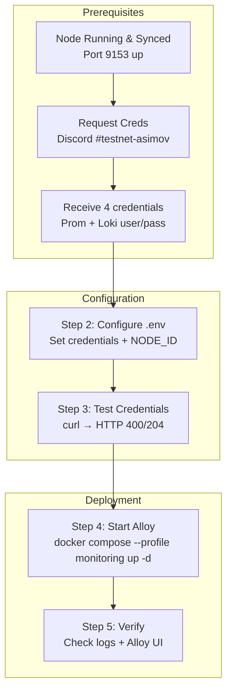

# GenLayer Validator Monitoring Setup Procedure

## Goal
Enable centralized monitoring by pushing metrics and logs to GenLayer Foundation's Grafana Cloud using Alloy.

## Process Overview



## Prerequisites

Before enabling monitoring:

1. **Node must be running** and accessible on ops port (default 9153)
2. **Metrics endpoint enabled** in config.yaml:
   ```yaml
   node:
     ops:
       port: 9153
       endpoints:
         metrics: true
   ```
3. **Verify local metrics available:**
   ```bash
   curl -s http://localhost:9153/metrics | head -20
   # Should return Prometheus-formatted metrics (genlayer_node_*)
   ```

## What Ships With the Node Tarball

The node tarball (v0.4.4+) **already includes** everything needed for monitoring:

- **`alloy-config.river`** — Full Alloy configuration for log collection and metrics forwarding
- **`docker-compose.yaml`** — Includes the Alloy service under the `monitoring` profile
- **`.env.example`** — Includes all monitoring environment variable placeholders

**You do NOT need to create these files manually.** The `alloy-config.river` symlink is created
automatically during installation/upgrade as part of the standard symlink setup (see `common-procedures.md` -> "Setup Symlinks"). You only need to:
1. Set credentials in `.env`
2. Start the monitoring profile

## Step 1: Request Credentials

**Credentials must be requested from the GenLayer Foundation team.**

1. Join the GenLayer Discord
2. Go to `#testnet-asimov` channel
3. Request monitoring credentials
4. You will receive **4 credential values** (Prometheus and Loki have separate auth):
   - **Prometheus** instance ID and API key (for metrics)
   - **Loki** instance ID and API key (for logs)

**IMPORTANT**: Prometheus and Loki use **different usernames** (instance IDs) in Grafana Cloud. They are separate services with separate credentials.

## Step 2: Configure Environment

Edit `.env` on the server to set the monitoring variables:

```bash
nano /opt/genlayer-node/.env
```

**Set these values:**

```bash
# Monitoring URLs (usually pre-filled in .env.example)
CENTRAL_MONITORING_URL=https://prometheus-prod-66-prod-us-east-3.grafana.net/api/prom/push
CENTRAL_LOKI_URL=https://logs-prod-042.grafana.net/loki/api/v1/push

# Prometheus credentials (for metrics)
CENTRAL_MONITORING_USERNAME=<Prometheus instance ID>
CENTRAL_MONITORING_PASSWORD=<API key - starts with glc_>

# Loki credentials (for logs)
CENTRAL_LOKI_USERNAME=<Loki instance ID>
CENTRAL_LOKI_PASSWORD=<API key - starts with glc_>

# Node identification (set these yourself)
NODE_ID=0xYourValidatorWalletAddress
VALIDATOR_NAME=your-validator-name
```

**Important notes:**
- `NODE_ID` — Use your validator wallet address (e.g., `0x1451c990fa6Fa23Bc2773266Fa022cBb369cE165`)
- `VALIDATOR_NAME` — A short identifier for your validator (no spaces, e.g., `edgars-asimov`)
- URLs should NOT have trailing slashes
- `CENTRAL_MONITORING_USERNAME` and `CENTRAL_LOKI_USERNAME` are typically **different** numeric IDs
- The password (API key) **may** be the same for both, but verify with your Foundation credentials

**Optional settings (defaults are usually fine):**
```bash
NODE_METRICS_ENDPOINT=host.docker.internal:9153
LOG_FILE_PATTERN=/var/log/genlayer/node*.log
METRICS_SCRAPE_INTERVAL=15s
METRICS_SCRAPE_TIMEOUT=10s
ALLOY_SELF_MONITORING_INTERVAL=60s
```

## Step 3: Test Credentials Before Starting

**CRITICAL**: Always test credentials before starting Alloy to avoid spamming error logs.

```bash
# Load env vars
set -a && source /opt/genlayer-node/.env && set +a

# Test Prometheus (metrics) — expect HTTP 400 (auth OK, empty body rejected)
echo "=== Prometheus ==="
curl -s -o /dev/null -w "HTTP %{http_code}" \
  -X POST \
  -u "${CENTRAL_MONITORING_USERNAME}:${CENTRAL_MONITORING_PASSWORD}" \
  "${CENTRAL_MONITORING_URL}"
echo ""

# Test Loki (logs) — expect HTTP 204 (auth OK, no content)
echo "=== Loki ==="
curl -s -o /dev/null -w "HTTP %{http_code}" \
  -X POST \
  -u "${CENTRAL_LOKI_USERNAME}:${CENTRAL_LOKI_PASSWORD}" \
  "${CENTRAL_LOKI_URL}" \
  -H "Content-Type: application/json" \
  --data-raw "{}"
echo ""
```

**Expected results:**
| Endpoint | HTTP Code | Meaning |
|----------|-----------|---------|
| Prometheus | **400** | Auth succeeded, empty body rejected (expected) |
| Loki | **204** | Auth succeeded, no content (expected) |
| Either | **401** | Auth failed — wrong username or password |
| Either | **403** | Forbidden — API key lacks required scope |

**Do NOT proceed until both return non-401 codes.**

## Step 4: Start Alloy

> **Note:** The `alloy-config.river` symlink is created automatically during installation/upgrade
> as part of the standard symlink setup (see `common-procedures.md` -> "Setup Symlinks").
> The file ships with every node tarball — you do NOT need to create or copy it manually.
> The docker-compose.yaml mounts `./alloy-config.river` from the working directory (`/opt/genlayer-node/`),
> which resolves through the symlink to the current version's config.

```bash
cd /opt/genlayer-node
docker compose --profile monitoring up -d
```

**First run will pull the Alloy image** (`grafana/alloy:v1.12.0`, ~150MB).

Verify Alloy is running:
```bash
docker ps | grep alloy
```

Expected:
```
genlayer-node-alloy  grafana/alloy:v1.12.0  ... Up ... 0.0.0.0:12345->12345/tcp
```

## Step 5: Verification

### 5.1 Check Alloy Logs (Most Important)

```bash
# Check for any errors (should be empty)
docker logs genlayer-node-alloy 2>&1 | grep -i "error\|401\|403"

# Check Prometheus status — look for "Done replaying WAL"
docker logs genlayer-node-alloy 2>&1 | grep "Done replaying WAL"

# Check Loki status — look for "tail routine: started"
docker logs genlayer-node-alloy 2>&1 | grep "tail routine: started"
```

**Healthy output (no errors):**
```
Done replaying WAL ... duration=12.8s
tail routine: started ... path=/var/log/genlayer/node.log
```

**Unhealthy output (401 spam):**
```
error="server returned HTTP status 401 Unauthorized"
```
If you see 401 errors, stop Alloy, fix credentials, test with curl, then restart.

### 5.2 Check Alloy UI

Via SSH tunnel:
```bash
# For GCP:
gcloud compute ssh INSTANCE --zone=ZONE --project=PROJECT -- -L 12345:localhost:12345

# For SSH:
ssh -L 12345:localhost:12345 user@your-server
```

Then open `http://localhost:12345` in your browser. The targets page should show `genlayer_node` target as **UP**.

### 5.3 Verify Local Metrics

```bash
curl -s http://localhost:9153/metrics | grep genlayer_node | head -10
```

### 5.4 Check Foundation Dashboard

Once metrics are flowing, your validator should appear on the GenLayer Foundation dashboard:

**Dashboard URL:** https://genlayerfoundation.grafana.net/public-dashboards/66a372d856ea44e78cf9ac21a344f792

Search for your validator using:
- `instance="0xYourValidatorWallet"`
- `validator_name="your-validator-name"`

## Troubleshooting

### Authentication Errors (401/403)
**Symptom:** Alloy logs show `server returned HTTP status 401 Unauthorized` spam.
```bash
docker logs genlayer-node-alloy 2>&1 | grep -c "401"
```

**Root causes:**
1. Wrong username or password in `.env`
2. Prometheus and Loki credentials mixed up (they use **different** instance IDs)
3. API key lacks required scope (`metrics:write` for Prometheus, `logs:write` for Loki)

**Fix:**
1. Stop Alloy: `docker compose --profile monitoring down`
2. Fix credentials in `.env`
3. Test with curl (Step 3 above)
4. Restart: `docker compose --profile monitoring up -d`

### Alloy Config File Not Found
**Symptom:** Alloy container fails to start.
```bash
docker logs genlayer-node-alloy 2>&1 | head -10
```

**Fix:** The `alloy-config.river` symlink should already exist from the install/upgrade symlink setup (see `common-procedures.md` -> "Setup Symlinks"). If missing, recreate it:
```bash
ln -sfn /opt/genlayer-node/${VERSION}/alloy-config.river /opt/genlayer-node/alloy-config.river
```

### No Data Being Pushed (No Errors Either)
**Symptom:** No errors in logs but no data on dashboard.
```bash
# Check if Alloy can reach the node metrics endpoint
docker exec genlayer-node-alloy wget -qO- http://host.docker.internal:9153/metrics | head -5
```

**Fix:** Ensure node is running, `extra_hosts` is in docker-compose.yaml, and `NODE_METRICS_ENDPOINT` is `host.docker.internal:9153` (not `localhost`).

### Connection Refused to Node Metrics
**Symptom:** Alloy logs show connection refused errors.

**Fix:** Check that:
- Node is running on port 9153: `curl http://localhost:9153/metrics`
- `extra_hosts` is configured in docker-compose.yaml (maps `host.docker.internal` to the host)
- The `NODE_METRICS_ENDPOINT` env var uses `host.docker.internal:9153` (Alloy runs inside Docker, so `localhost` won't reach the host node)

### URL Format
**Fix:** Ensure URLs in `.env` match this format (no trailing slashes):
```bash
# Correct
CENTRAL_MONITORING_URL=https://prometheus-prod-66-prod-us-east-3.grafana.net/api/prom/push
CENTRAL_LOKI_URL=https://logs-prod-042.grafana.net/loki/api/v1/push

# Wrong (trailing slash)
CENTRAL_MONITORING_URL=https://prometheus-prod-66.../api/prom/push/
```

## Environment Variables Reference

| Variable | Required | Description | Example |
|----------|----------|-------------|---------|
| `CENTRAL_MONITORING_URL` | Yes | Prometheus remote write URL | `https://prometheus-prod-66-...grafana.net/api/prom/push` |
| `CENTRAL_LOKI_URL` | Yes | Loki log push URL | `https://logs-prod-042.grafana.net/loki/api/v1/push` |
| `CENTRAL_MONITORING_USERNAME` | Yes | Prometheus instance ID (numeric) | `1234567` |
| `CENTRAL_MONITORING_PASSWORD` | Yes | Prometheus API key | `glc_xxxxx...` |
| `CENTRAL_LOKI_USERNAME` | Yes | Loki instance ID (numeric, **different** from Prometheus) | `9876543` |
| `CENTRAL_LOKI_PASSWORD` | Yes | Loki API key | `glc_xxxxx...` |
| `NODE_ID` | Yes | Validator wallet address | `0x1451c990...` |
| `VALIDATOR_NAME` | Yes | Short validator name (no spaces) | `edgars-asimov` |
| `NODE_METRICS_ENDPOINT` | No | Node metrics address | `host.docker.internal:9153` |
| `LOG_FILE_PATTERN` | No | Log file glob pattern | `/var/log/genlayer/node*.log` |
| `METRICS_SCRAPE_INTERVAL` | No | How often to scrape metrics | `15s` |
| `METRICS_SCRAPE_TIMEOUT` | No | Scrape timeout | `10s` |
| `ALLOY_SELF_MONITORING_INTERVAL` | No | Alloy self-health check interval | `60s` |

## Stopping / Restarting Monitoring

```bash
# Stop Alloy only (node keeps running)
docker compose --profile monitoring down

# Restart Alloy
docker compose --profile monitoring up -d

# View Alloy logs
docker logs -f genlayer-node-alloy

# WARNING: 'docker compose down' without --profile stops ALL containers including WebDriver
# Always use --profile monitoring to only affect Alloy
```

## Important: Alloy Must Restart When Node Restarts

**CRITICAL**: When the genlayer-node service restarts (during upgrades or otherwise), Alloy's
bind mount to the log directory becomes stale. The container continues reading from the old
log path, and **no new logs are sent to Grafana**.

**Symptoms of stale bind mount:**
- Node is running and healthy (`curl localhost:9153/health` returns OK)
- But Grafana shows no logs/metrics for this validator
- Validator appears offline in monitoring dashboards
- May lead to heartbeat failures and validator banning

**Solution:** The systemd service should include `ExecStartPost` to auto-restart Alloy:
```ini
ExecStartPost=-/bin/sh -c 'sleep 5 && /usr/bin/docker restart genlayer-node-alloy 2>/dev/null || true'
```

If your existing systemd service doesn't have this line, add it:
```bash
# Edit the service file
sudo nano /etc/systemd/system/genlayer-node.service

# Add after ExecStart line:
# ExecStartPost=-/bin/sh -c 'sleep 5 && /usr/bin/docker restart genlayer-node-alloy 2>/dev/null || true'

# Reload and restart
sudo systemctl daemon-reload
sudo systemctl restart genlayer-node
```

**Manual fix (if Alloy is already stale):**
```bash
docker restart genlayer-node-alloy
```

See `sharp-edges.yaml` -> `alloy-stale-bind-mount` for detailed explanation.
