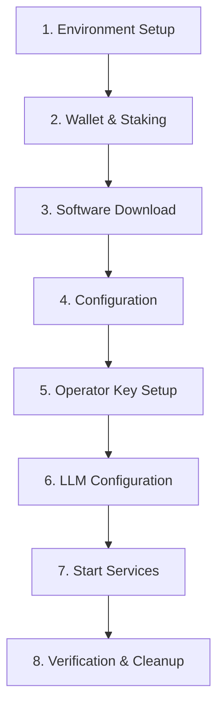

# GenLayer Validator Setup

Interactive wizard to set up a GenLayer validator node from scratch on a Linux server.

## MANDATORY: Show Process Overview at Start

**CRITICAL REQUIREMENT**: At the very beginning of ANY setup or upgrade operation, you MUST display a complete overview of ALL steps that will be performed. This is NON-NEGOTIABLE.

### Before Starting ANY Installation or Upgrade:

1. **Display the full process overview** showing all steps that will be executed
2. **Ask user to confirm** they want to proceed with the installation/upgrade
3. **Before EACH step**, briefly explain what that step will do before executing it

### Required Start Message Format:

```
## GenLayer Validator Node Setup

I'll guide you through the complete validator node installation. Here's what we'll do:

**Step 1: Determine Server Location**
- Identify where the validator will run (local/GCP/AWS/SSH)
- Configure access method for commands

**Step 2: Verify Prerequisites**
- Check system architecture (must be x86_64)
- Verify RAM, CPU, and disk space
- Check Node.js, Docker, Python installations

**Step 3: New or Existing Validator**
- New: Run staking wizard (requires 42,000+ GEN)
- Existing: Provide validator wallet address

**Step 4: Download & Extract Node Software**
- Download GenLayer node tarball from official storage
- Extract to /opt/genlayer-node/${VERSION}/
- Set up directory structure and symlinks
- Run GenVM setup to download dependencies

**Step 5: Configure Environment (.env)**
- Create .env from example template
- Configure RPC and WebSocket URLs
- Set LLM provider (you'll add API key manually)

**Step 6: Configure Node (config.yaml)**
- Set validator wallet address
- Configure operator address
- Set network endpoints and ports

**Step 7: Set Up Operator Key**
- Import keystore from staking wizard, OR
- Copy from previous installation, OR
- Generate new operator key

**Step 8: Start WebDriver Container**
- Launch WebDriver via Docker Compose
- Wait for health check to pass

**Step 9: Run Doctor Check**
- Verify GenVM binaries are installed
- Verify WebDriver connectivity

**Step 10: Choose Deployment Method**
- Systemd service (recommended)
- Docker Compose
- Manual (screen/tmux)

**Step 11: Verify Node Running**
- Check health endpoint
- Verify sync status

**Estimated time: 20-45 minutes**

Ready to begin?
```

### Before Each Step:

Always show a brief description of what will happen:

```
## Step 4: Download & Extract Node Software

This step will:
1. Download the GenLayer node v0.4.4 tarball (~XX MB)
2. Create directory /opt/genlayer-node/v0.4.4/
3. Extract binary, configs, and GenVM files
4. Set up symlinks for easy access
5. Run GenVM setup to download dependencies (~2 min)

Proceeding...
```

**NEVER skip showing what a step will do before executing it.**

---

## What This Skill Will Do

This skill guides you through the complete validator node installation process. When you invoke this skill, it will:

1. **Determine your setup environment** - Local machine, remote server (SSH), or cloud VM (GCP/AWS/Azure)
2. **Verify prerequisites** - Check that your server meets minimum requirements (architecture, RAM, software dependencies)
3. **Guide wallet setup** - Help create a new validator wallet or use an existing one
4. **Download node software** - Fetch the specified version (or latest) from official storage
5. **Generate configuration** - Create config.yaml and .env files with your specific settings
6. **Import/generate operator keys** - Set up the validator's operator account
7. **Configure LLM provider** - Set up API keys for intelligent contract execution
8. **Start the node** - Launch as systemd service, Docker Compose, or manual process
9. **Verify installation** - Check health and sync status
10. **Optional: Enable monitoring** - Set up telemetry push to central monitoring

**Total time estimate**: 20-45 minutes depending on your experience level and setup method.

## CRITICAL: Update Procedure Warning

**If you are UPDATING an existing node, read this first:**

### Zero-Downtime Update Procedure
**NEVER stop your old node before preparing the new version!**

Traditional update process (WRONG - causes 3-4 min downtime):
```
Stop node -> Download -> Extract -> GenVM setup (2 min) -> Start
```

**Correct procedure (10-15 sec downtime):**
```
Download -> Extract -> GenVM setup WHILE OLD NODE RUNS
THEN: Stop old -> Switch symlinks -> Start new
```

**Impact of wrong procedure:**
- 3-4 minutes downtime vs 10-15 seconds
- Missed 12-24 validation opportunities
- Lost rewards during downtime
- Validator needs to re-prime
- Potential slashing penalties

**See `update-procedure.md` for detailed zero-downtime update steps.**

**For fresh installations, see `install-procedure.md` for the step-by-step installation guide.**

### Database Storage Structure
For patch versions (v0.4.x), the database MUST be shared, not copied:

**Correct structure:**
```
/opt/genlayer-node/v0.4/data/node/genlayer.db    <- Shared DB
/opt/genlayer-node/v0.4.3/data/node/genlayer.db  -> symlink to shared
/opt/genlayer-node/v0.4.4/data/node/genlayer.db  -> symlink to shared
```

### LLM Strategy and Provider Configuration

Two LLM strategies are available:
- **default** — Random provider selection from enabled backends
- **greybox** — Deterministic ordered fallback via OpenRouter (requires `OPENROUTERKEY`)

```bash
# 1. Apply release LLM config (has all backends)
cp third_party/genvm/config/genvm-modules-llm-release.yaml \
   third_party/genvm/config/genvm-module-llm.yaml

# 2. For greybox strategy, switch lua script:
sed -i 's/genvm-llm-default\.lua/genvm-llm-greybox.lua/' \
  third_party/genvm/config/genvm-module-llm.yaml

# 3. Enable your provider (replace <provider> with name from mapping):
# Provider mapping (env var -> config name):
#   HEURISTKEY -> heurist
#   COMPUT3KEY -> comput3
#   IOINTELLIGENCEKEY -> ionet
#   LIBERTAI_API_KEY -> libertai
#   ANTHROPICKEY -> anthropic
#   GEMINIKEY -> google
#   OPENROUTERKEY -> openrouter
#   MORPHEUS_API_KEY -> morpheus
sed -i '/^  <provider>:/,/^  [a-z]/ s/enabled: false/enabled: true/' \
  third_party/genvm/config/genvm-module-llm.yaml
```

**Symptom if not enabled:** Node fails to start with "module_failed_to_start" error.

### Updating Greybox on a Running Node
To update the Lua script or LLM YAML without a full redeploy, see
`common-procedures.md` -> "Update Greybox Config on Running Node".
Key points:
- Update files in all GenVM instance config directories
- Restart LLM module per GenVM manager: `curl -X POST http://127.0.0.1:<port>/module/stop` then `/module/start`
- No atomic restart — each instance restarts independently

---

## Requirements

Before starting, ensure your setup meets these requirements:

### System Requirements
- **Architecture**: AMD64 (x86_64) Linux server - ARM64 is NOT supported
- **RAM**: Minimum 16GB (32GB recommended for production)
- **CPU**: Minimum 8 cores (16+ recommended for production)
- **Storage**: Minimum 128GB SSD (256GB+ recommended for production)
- **Operating System**: Ubuntu 20.04+, Debian 11+, or compatible Linux distribution

### Software Dependencies
- **Node.js**: v18 or higher
- **Docker**: v20.10 or higher with Compose plugin
- **Python**: Python 3.8+ with pip and venv modules
- **Git**: For version control (optional but recommended)

### Blockchain Requirements
- **GEN Tokens**: 42,000+ GEN for self-stake (if creating new validator)
- **ETH**: Small amount of ETH for gas fees on operator account (~0.1 ETH recommended)
- **RPC Access**: HTTP and WebSocket URLs for GenLayer Chain (ZkSync-based)

### API Keys Required
- **LLM Provider**: API key from one of these providers:
  - Heurist (recommended for validators)
  - Comput3
  - io.net
  - LibertAI
  - Anthropic
  - Google (Gemini)

### Access Requirements
- **SSH Access**: If installing on remote server (username@hostname)
- **Sudo Privileges**: Installation requires root or sudo access
- **Port Access**: Ports 9151 (RPC), 9153 (Ops), 9155 (Admin), 4444 (WebDriver) must be available

## Installation Process Overview



### Version Handling

When specifying a version:
- **Specific version**: Use exact version like `v0.4.4`
- **Latest version**: Use `latest` to automatically download the most recent release
- **No version specified**: Skill will prompt you to choose from the 5 most recent versions

The skill automatically handles:
- Version-specific directory structure (`/opt/genlayer-node/v0.4.4/`)
- Shared database storage across patch versions (v0.4.x shares same DB)
- Version-specific keystore and logs for safety
- Symlinks for easy access to current version

## Purpose

Guide validators through complete GenLayer node installation including:
- Prerequisites verification (Python3, pip, venv, Docker, Node.js)
- Wallet creation via staking wizard (requires 42,000+ GEN)
- Node software download and extraction
- Configuration via config.yaml and .env file
- Operator key import from wizard export
- LLM provider setup (Heurist, Comput3, io.net, LibertAI, Anthropic, Google)
- Node startup as systemd service (binary) or Docker Compose
- Optional telemetry/monitoring setup

## Quick Reference

### Directory Structure After Installation
```
/opt/genlayer-node/
├── v0.4.4/                         # Version-specific directory
│   ├── bin/genlayernode
│   ├── third_party/genvm/
│   ├── docker-compose.yaml
│   ├── .env
│   ├── data/node/
│   │   ├── genlayer.db
│   │   ├── keystore/
│   │   ├── logs/
│   │   └── merkle/
│   └── configs/node/config.yaml
├── bin -> v0.4.4/bin               # Symlinks for easy access
├── third_party -> v0.4.4/third_party
├── data -> v0.4.4/data
├── configs -> v0.4.4/configs
├── docker-compose.yaml -> v0.4.4/docker-compose.yaml
├── .env -> v0.4.4/.env
├── alloy-config.river -> v0.4.4/alloy-config.river  # Symlink (ships with tarball)
└── genvm-module-web-docker.yaml -> v0.4.4/genvm-module-web-docker.yaml
```

### Requires
- AMD64 Linux server (16GB+ RAM, 8+ cores, 128GB+ SSD)
- Node.js v18+, Docker, Python 3 with pip and venv
- 42,000+ GEN tokens for self-stake (if new validator)
- LLM API key from supported provider
- Operator keystore from staking wizard (or generate new)

### Default Configuration
| Setting | Default Value |
|---------|---------------|
| RPC URL | **No default** - user must provide |
| WebSocket | **No default** - user must provide |
| Consensus Address | `0xe66B434bc83805f380509642429eC8e43AE9874a` |
| Genesis Block | `17326` |
| Install Path | `/opt/genlayer-node` |
| RPC Port | `9151` |
| Ops Port | `9153` |
| Admin Port | `9155` |
| Metrics Interval | `15s` |

### LLM Provider Environment Variables
| Provider | Environment Variable |
|----------|---------------------|
| Heurist | `HEURISTKEY` |
| Comput3 | `COMPUT3KEY` |
| io.net | `IOINTELLIGENCEKEY` |
| LibertAI | `LIBERTAI_API_KEY` |
| Anthropic | `ANTHROPICKEY` |
| Google | `GEMINIKEY` |
| xAI (Grok) | `XAIKEY` |
| Atoma | `ATOMAKEY` |
| OpenRouter | `OPENROUTERKEY` |
| Morpheus | `MORPHEUS_API_KEY` |

## Installation Flow

The skill guides through these steps interactively:

### 0. Determine Server Location and Access Method
**CRITICAL FIRST STEP**: Before any installation begins, determine where the validator will run and how to access it.

**Question**: "Where will you run the validator node?"

**Options**:
- **This machine (local setup)**: Running validator on this computer
  - Commands execute directly via Bash tool
  - Files copied using local filesystem
  - Health checks use localhost
- **Remote Linux server (SSH)**: Generic Linux server accessed via SSH
  - Provide commands as text for user to run via SSH
  - File transfers via scp
  - Collect: username@hostname or username@IP
- **Google Cloud Platform VM**: GCP Compute Engine instance
  - Commands use gcloud compute ssh
  - File transfers via gcloud compute scp
  - Collect: project-id/zone/instance-name
- **AWS EC2 Instance**: Amazon Web Services EC2 instance
  - Commands use AWS Systems Manager or SSH
  - File transfers via scp or AWS transfer
  - Collect: instance-id/region
- **Azure VM**: Azure Virtual Machine
  - Commands use Azure CLI or SSH
  - File transfers via scp
  - Collect: resource-group/vm-name
- **Other cloud provider**: DigitalOcean, Linode, Vultr, etc.
  - Commands use standard SSH
  - File transfers via scp

**Impact**: This choice affects ALL subsequent steps:
- How commands are executed (direct vs via SSH)
- How files are transferred (cp vs scp vs cloud-specific tools)
- How to verify installation (local curl vs SSH tunneling)
- Which CLI tools are needed (gcloud, aws cli, azure cli)

### 1. Check Prerequisites
Verify system meets requirements before starting:

```bash
# Check architecture (must be x86_64)
uname -m

# Check Node.js (v18+ required)
node --version

# Check Docker and Docker Compose
docker --version
docker compose version

# Check Python 3 with pip and venv
python3 --version
pip3 --version
python3 -m venv --help
```

**Minimum requirements:**
- AMD64 (x86_64) architecture
- 16GB+ RAM, 8+ CPU cores, 128GB+ SSD
- Node.js v18+
- Docker with Compose plugin
- Python 3 with pip and venv

### 1. New Validator or Existing?
**Note**: The staking wizard runs on your **local machine** (not the server), since it manages wallet keys.

- **New**: Run staking wizard (requires 42,000+ GEN)
  ```bash
  npm install -g genlayer
  genlayer staking wizard --network testnet-asimov
  ```
  The wizard is **fully interactive** (requires TTY) and guides you through:
  1. Account selection or creation (owner account)
  2. Network selection
  3. Balance verification (42,000+ GEN minimum)
  4. Operator setup — creates a separate operator account and exports its keystore
  5. Stake amount confirmation
  6. On-chain validator registration — returns your **validator wallet address**
  7. Optional identity setup (moniker, website, socials)

  **Three addresses are produced:**
  | Address | Purpose |
  |---------|---------|
  | **Owner** | Cold wallet that controls withdrawals (stays on local machine) |
  | **Operator** | Hot wallet that signs blocks (goes on the server via keystore) |
  | **Validator Wallet** | Smart contract deployed on-chain (used in config.yaml) |

  **After the wizard, save:**
  - Validator wallet address → for `config.yaml`
  - Operator address → for `config.yaml`
  - Operator keystore file → upload to server
  - Export passphrase → needed for keystore import on server

  **After the wizard, fund the operator:**
  The operator account starts with 0 GEN and needs funds for gas fees to sign validation transactions.
  ```bash
  # Check operator balance
  genlayer account show --account "Operator Name"

  # Send GEN from owner to operator (recommended: 10 GEN)
  genlayer account send 0xOPERATOR_ADDRESS 10gen --account "Owner Name" --network testnet-asimov
  ```

  **See `staking-wizard-procedure.md` for the complete step-by-step wizard walkthrough, alternative CLI commands, and troubleshooting.**

- **Existing**: Skip to download (must have validator wallet address and operator keystore)

### 2. Download & Setup
**Note**: For remote servers, download to the remote server, not your local machine.

**List available versions:**
```bash
curl -s "https://storage.googleapis.com/storage/v1/b/gh-af/o?prefix=genlayer-node/bin/amd64" | \
  grep -o '"name": *"[^"]*"' | sed -n 's/.*\/\(v[^/]*\)\/.*/\1/p' | sort -ru | head -5
```

**Download and extract (replace ${VERSION} with actual version, e.g., v0.4.4):**
```bash
# Download to /tmp
wget https://storage.googleapis.com/gh-af/genlayer-node/bin/amd64/${VERSION}/genlayer-node-linux-amd64-${VERSION}.tar.gz \
  -O /tmp/genlayer-node-${VERSION}.tar.gz

# Create versioned directory and extract
sudo mkdir -p /opt/genlayer-node/${VERSION}
sudo tar -xzvf /tmp/genlayer-node-${VERSION}.tar.gz \
  -C /opt/genlayer-node/${VERSION} --strip-components=1

# Create data and config directories inside version folder
sudo mkdir -p /opt/genlayer-node/${VERSION}/{data/node,configs/node}
sudo chown -R $USER:$USER /opt/genlayer-node

# Setup symlinks for easy access
ln -sfn /opt/genlayer-node/${VERSION}/bin /opt/genlayer-node/bin
ln -sfn /opt/genlayer-node/${VERSION}/third_party /opt/genlayer-node/third_party
ln -sfn /opt/genlayer-node/${VERSION}/data /opt/genlayer-node/data
ln -sfn /opt/genlayer-node/${VERSION}/configs /opt/genlayer-node/configs
ln -sfn /opt/genlayer-node/${VERSION}/docker-compose.yaml /opt/genlayer-node/docker-compose.yaml
ln -sfn /opt/genlayer-node/${VERSION}/.env /opt/genlayer-node/.env
ln -sfn /opt/genlayer-node/${VERSION}/alloy-config.river /opt/genlayer-node/alloy-config.river
ln -sfn /opt/genlayer-node/${VERSION}/genvm-module-web-docker.yaml /opt/genlayer-node/genvm-module-web-docker.yaml
```

**Run GenVM setup:**
```bash
python3 /opt/genlayer-node/third_party/genvm/bin/setup.py
```

This downloads GenVM dependencies (genvm binary and genvm-modules).

### 3. Environment Configuration (.env)

**IMPORTANT**: Always start from the `.env.example` included in the downloaded artifact. This ensures all required variables are present.

First ask if user wants to copy existing .env or create from example:
- **Use example (Recommended)**: Copy from artifact's `.env.example`, then customize
- **Copy from previous**: Copy .env from previous installation

**Create .env from example:**
```bash
cp /opt/genlayer-node/${VERSION}/.env.example /opt/genlayer-node/${VERSION}/.env
```

**Key values to configure:**
1. **Rollup URLs** - Add these lines (not in .env.example by default):
   ```bash
   GENLAYERNODE_ROLLUP_GENLAYERCHAINRPCURL=<RPC_URL_FROM_USER>
   GENLAYERNODE_ROLLUP_GENLAYERCHAINWEBSOCKETURL=<WSS_URL_FROM_USER>
   ```

2. **LLM API Key** - Set ONE of these (leave others empty):
   - `HEURISTKEY=`
   - `ANTHROPICKEY=`
   - `GEMINIKEY=`
   - Or the env var for your chosen provider (see LLM Provider Environment Variables table)

3. **Node Password** - Update `NODE_PASSWORD=` with a secure password

**After creating .env, instruct user to:**
1. SSH to the VM: `gcloud compute ssh USER@VM --zone=ZONE`
2. Edit the .env file: `nano /opt/genlayer-node/.env`
3. Set the LLM API key for their chosen provider
4. Set a secure `NODE_PASSWORD`
5. Save and confirm when done

### 4. Node Configuration (config.yaml)

**IMPORTANT**: Always start from the example config included in the downloaded artifact (`configs/node/config.yaml.example`). This ensures the config format is compatible with the installed version.

First ask if user wants to copy existing config or use example:
- **Use example config (Recommended)**: Copy from artifact's config.yaml.example, then customize via wizard
- **Copy from previous**: Copy config.yaml from previous installation

#### Configuration Wizard (Group-based)
After copying the base config, go through each configuration GROUP and ask whether to modify or keep defaults:

**Group 1: Node Identity**
- Ask: "Do you want to modify Node Identity settings?" (Keep defaults / Modify)
- If modify: Ask for validator address, operator address

**Group 2: RPC Endpoints**
- Ask: "Do you want to modify RPC Endpoint settings?" (Keep defaults / Modify)
- If modify: Ask for port, enabled groups (genlayer, genlayer_debug, ethereum, zksync)

**Group 3: Ops Endpoints**
- Ask: "Do you want to modify Ops Endpoint settings?" (Keep defaults / Modify)
- If modify: Ask for port, enable metrics/health/balance endpoints

**Group 4: Admin Endpoints**
- Ask: "Do you want to modify Admin Endpoint settings?" (Keep defaults / Modify)
- If modify: Ask for port

**Group 5: Metrics Configuration**
- Ask: "Do you want to modify Metrics settings?" (Keep defaults / Modify)
- If modify: Ask for collection intervals

**Note**: Rollup URLs (RPC, WebSocket) are configured in .env. Contract addresses and other settings remain in config.yaml with defaults.

### 5. Operator Key
First ask how user wants to provide the operator key:

**Source options:**
- **Upload keystore.json** - Upload the keystore.json file exported from staking wizard (requires passphrase to import)
- **Upload keystore directory** - Upload the keystore directory directly (no import needed, just copy to data/node/keystore/)
- **Copy from previous** - Copy keystore from existing installation on this VM
- **Generate new** - Create new key
  - Must fund new address with ETH for gas fees
  - Must update validator settings to use new operator address

**Upload flow:**
1. Ask which type of file user has (keystore.json or keystore directory)
2. **Create the keystore directory first** (required before upload):
   ```bash
   mkdir -p /opt/genlayer-node/${VERSION}/data/node/keystore
   ```
3. **Provide upload instructions based on server location (from Step 0)**:

   **For local setup:**
   ```bash
   # Copy keystore.json
   cp ./keystore.json /opt/genlayer-node/${VERSION}/data/node/keystore.json

   # Or copy keystore directory
   cp -r ./keystore/* /opt/genlayer-node/${VERSION}/data/node/keystore/
   ```

   **For remote SSH server:**
   ```bash
   # Upload keystore.json
   scp ./keystore.json username@hostname:/opt/genlayer-node/${VERSION}/data/node/keystore.json

   # Or upload keystore directory
   scp -r ./keystore/* username@hostname:/opt/genlayer-node/${VERSION}/data/node/keystore/
   ```

   **For GCP VM:**
   ```bash
   # Upload keystore.json
   gcloud compute scp ./keystore.json instance-name:/opt/genlayer-node/${VERSION}/data/node/keystore.json \
     --project=project-id --zone=zone

   # Or upload keystore directory
   gcloud compute scp --recurse ./keystore/* instance-name:/opt/genlayer-node/${VERSION}/data/node/keystore/ \
     --project=project-id --zone=zone
   ```

   **For AWS EC2:**
   ```bash
   # Upload keystore.json (assuming SSH access)
   scp -i ~/.ssh/your-key.pem ./keystore.json ec2-user@instance-ip:/opt/genlayer-node/${VERSION}/data/node/keystore.json

   # Or upload keystore directory
   scp -i ~/.ssh/your-key.pem -r ./keystore/* ec2-user@instance-ip:/opt/genlayer-node/${VERSION}/data/node/keystore/
   ```

4. Wait for user confirmation
5. Verify upload:
   ```bash
   ls -la /opt/genlayer-node/${VERSION}/data/node/keystore/
   ```
6. For keystore.json: Run import command (user provides passphrase manually on VM):
   ```bash
   cd /opt/genlayer-node && source .env && ./bin/genlayernode account import \
     --password "$NODE_PASSWORD" \
     --path /opt/genlayer-node/${VERSION}/data/node/keystore.json
   ```
   Note: User will be prompted for the export passphrase interactively
7. For keystore directory: Already in correct location, just verify contents show UTC--* file

**Note**: Always use the version-specific path (e.g., `/opt/genlayer-node/v0.4.4/data/node/keystore/`), not the symlink path.

### 6. Start WebDriver
WebDriver is required for web-based contract operations. Start it before running doctor check:

```bash
cd /opt/genlayer-node && docker compose up -d
```

Wait for WebDriver to be healthy:
```bash
until docker inspect --format='{{.State.Health.Status}}' genlayer-node-webdriver | grep -q 'healthy'; do
  echo "Waiting for WebDriver to be healthy..."
  sleep 2
done
echo "WebDriver is healthy!"
```

Verify WebDriver is running:
```bash
docker ps | grep webdriver
curl -s http://localhost:4444/status | jq '.value.ready'
```

### 7. Run Doctor Check
Run the doctor command to verify all configuration is correct:

```bash
cd /opt/genlayer-node && source .env && ./bin/genlayernode doctor check
```

**Expected output on success:**
```
GenLayer Node Doctor
===================

  ✓ GenVM Binaries: Found at /opt/genlayer-node/third_party/genvm/bin
  ✓ WebDriver: Connected to http://localhost:4444 (ready: true)

✓ All checks passed!
```

**If checks fail:**
- GenVM Binaries missing: Re-run `python3 /opt/genlayer-node/third_party/genvm/bin/setup.py`
- WebDriver not ready: Check `docker logs genlayer-node-webdriver`

### 8. Deployment Method
Ask user which deployment method they prefer:

- **Systemd Service** (Recommended): Auto-restart, journald logs
- **Docker Compose**: All-in-one containers
- **Manual**: screen/tmux session

#### Systemd Service Setup (Recommended)

1. Create the service file at `/etc/systemd/system/genlayer-node.service`:

```ini
[Unit]
Description=GenLayer Node
After=network.target docker.service
Requires=docker.service

[Service]
Type=simple
User=root
WorkingDirectory=/opt/genlayer-node
EnvironmentFile=/opt/genlayer-node/.env
ExecStart=/opt/genlayer-node/bin/genlayernode run --password ${NODE_PASSWORD}
Restart=always
RestartSec=10

[Install]
WantedBy=multi-user.target
```

2. Enable and start the service:
```bash
sudo systemctl daemon-reload
sudo systemctl enable genlayer-node
sudo systemctl start genlayer-node
```

3. Check service status:
```bash
sudo systemctl status genlayer-node
```

4. View logs:
```bash
journalctl -u genlayer-node -f
```

#### Docker Compose Deployment

```bash
cd /opt/genlayer-node && source .env && docker compose --profile node up -d
```

#### Manual Deployment (screen/tmux)

```bash
screen -S genlayer
cd /opt/genlayer-node && source .env && ./bin/genlayernode run --password "$NODE_PASSWORD"
# Detach: Ctrl+A, D
# Reattach: screen -r genlayer
```

### 9. Verify Node Running

After starting the node, verify it's running and syncing:

**Health check:**
```bash
curl -s http://localhost:9153/health | jq
```

Expected response:
```json
{
  "status": "up",
  "checks": { ... }
}
```

**Sync status:**
```bash
curl -s http://localhost:9153/metrics | grep genlayer_node_synced
```

Expected output (1 = synced, 0 = syncing):
```
genlayer_node_synced{node="0x..."} 1
```

**Check blocks behind:**
```bash
curl -s http://localhost:9153/metrics | grep genlayer_node_blocks_behind
```

**View logs (systemd):**
```bash
journalctl -u genlayer-node -f --no-hostname
```

**View logs (Docker):**
```bash
docker logs -f genlayer-node
```

### 10. Monitoring (Optional)
- Enable telemetry push to GenLayer Foundation's Grafana Cloud using Alloy
- Requires monitoring credentials (request from Foundation Discord `#testnet-asimov`)
- Collects Prometheus metrics and node logs
- See `monitoring-procedure.md` for complete setup
- Reference: https://docs.genlayer.com/validators/monitoring

## Deployment Methods

### Binary (Systemd Service) - Recommended for production
- Persistent service with auto-restart
- Logs via journalctl
- Environment from .env file
- Service file at `/etc/systemd/system/genlayer-node.service`

### Docker Compose
- All-in-one container deployment
- Includes monitoring profile
- Override files for LLM config

## Automation

This skill is defined by canonical YAML files:

- **skill.yaml** - Main procedure, patterns, anti-patterns, defaults, config wizard
- **sharp-edges.yaml** - 30+ common gotchas with detection and fixes
- **validations.yaml** - 25+ automated pre/post checks
- **collaboration.yaml** - Dependencies and composition

## Usage

Invoke this skill when:
- Setting up a new validator node
- Someone asks "how do I become a validator"
- Installing GenLayer node software
- Troubleshooting validator installation issues
- Upgrading an existing node

The skill will guide through each step interactively, verifying prerequisites and configuration at each stage.

### How to Invoke

**Basic invocation:**
```
I want to set up a validator node
```

**With specific version:**
```
Install validator node version v0.4.4
```

**With latest version:**
```
Install validator node using the latest version
```
or simply:
```
Install validator node latest
```

When you use the word "latest", the skill will automatically fetch and install the most recent version from the official storage.

## Complete Installation Steps

| Step | Description | Key Actions |
|------|-------------|-------------|
| 0 | **Determine Server Location** | **Local vs Remote, SSH vs GCP vs AWS** |
| 1 | Check Prerequisites | Architecture, Node.js, Docker, Python |
| 2 | New Validator or Existing? | Staking wizard or skip |
| 3 | Download & Setup | Download tarball, extract, create directories, symlinks, run GenVM setup |
| 4 | Environment (.env) | RPC URL, WebSocket URL, LLM key placeholder, password placeholder |
| 5 | Node Config (config.yaml) | Validator address, operator address, ports |
| 6 | Operator Key | Upload keystore (method depends on Step 0) or generate new |
| 7 | Start WebDriver | `docker compose up -d`, wait for healthy |
| 8 | Run Doctor Check | Verify all configuration |
| 9 | Deployment Method | Systemd (recommended), Docker, or manual |
| 10 | Verify Node Running | Health check, sync status |
| 11 | Monitoring (Optional) | Enable telemetry push |

## Key Decision Points

1. **Server location?** -> Local / Remote SSH / GCP / AWS / Azure / Other cloud
2. **New validator?** -> Staking wizard or skip
3. **.env source?** -> Copy from previous / Create new
4. **Config source?** -> Use example (recommended) / Copy from previous
5. **Operator key?** -> Upload keystore.json / Upload keystore directory / Copy from previous / Generate new
6. **Deployment?** -> Systemd (recommended) / Docker / Manual
7. **Monitoring?** -> Enable / Skip

## Critical Input Rules

**IMPORTANT**: When collecting user inputs, follow these rules:

### .env Configuration (Step 3) - Ask via Wizard
Use AskUserQuestion with these options (tool requires minimum 2 options):
- **RPC URL** - Options: ["Skip for now", "I'll enter my URL"]
- **WebSocket URL** - Options: ["Skip for now", "I'll enter my URL"]

**IMPORTANT**: The "Other" text field in AskUserQuestion does not work reliably. When user selects "I'll enter my URL", follow up with a **plain text question** asking them to type the URL directly.

Example flow:
```
Step 1: AskUserQuestion
  Question: "Do you have the GenLayer Chain RPC URL?"
  Options:
    - "Skip for now" (will need to configure manually later)
    - "I'll enter my URL"

Step 2: If user selected "I'll enter my URL", ask:
  "Please enter the RPC URL:"
  [User types URL directly in chat]
```

### config.yaml Configuration (Step 4) - Node Identity Group
These values are configured in config.yaml during the Node Identity group:
- **Validator Wallet Address** - Ask in Group 1: Node Identity
- **Operator Address** - Ask in Group 1: Node Identity (will be set after importing operator key)

### Sensitive Values - NEVER Ask for These
These values must NEVER be collected by Claude. Generate .env with placeholders, then ask user to update manually on the VM:
- **LLM API Key** - Generate placeholder: `YOUR_API_KEY_HERE`
- **Node Password** - Generate placeholder: `YOUR_PASSWORD_HERE`

After generating .env, instruct user to:
1. SSH to the VM
2. Edit the .env file manually to set sensitive values
3. Confirm when done

## Secret Masking Policy

**CRITICAL**: When displaying any output that may contain secret values, they MUST be masked.

### What Qualifies as a Secret
- **LLM API Keys**: `HEURISTKEY`, `COMPUT3KEY`, `IOINTELLIGENCEKEY`, and other provider keys
- **Passwords**: `NODE_PASSWORD`, export passphrases
- **Auth Tokens**: Monitoring credentials, API tokens
- **Private Keys**: Never displayed at all

### FORBIDDEN OPERATIONS

**NEVER execute these types of commands that expose secrets:**

```bash
# FORBIDDEN - DO NOT USE
grep '<LLM_KEY>' /opt/genlayer-node/.env
cat /opt/genlayer-node/.env | grep KEY
gcloud compute ssh ... --command="grep '<LLM_KEY>' /opt/genlayer-node/.env"
ssh username@host "cat /opt/genlayer-node/.env"
```

**Why this is forbidden:**
1. **Exposes secrets in command output** - Keys will be visible in plain text
2. **Violates security policy** - Secrets must NEVER be displayed unmasked
3. **Creates audit trail of secrets** - Command history will contain the secret
4. **Risk of screenshot/log exposure** - User may share output containing secrets

**Instead, instruct the user to check values themselves:**
```bash
# CORRECT - Instruct user to run this on their VM
"To verify your API key is set, SSH to your VM and run:
  grep '<YOUR_LLM_KEY>' /opt/genlayer-node/.env
This will show the key value on your secure terminal."
```

### Masking Rules

1. **When displaying .env file contents**:
   - Mask all API keys showing only first 8 and last 4 characters
   - Example: `HEURISTKEY=abc12345********...xyz9` instead of full key

2. **When displaying command output**:
   - If output contains secrets, mask them before showing to user
   - Example: `export HEURISTKEY=abc12345********...xyz9`

3. **When verifying configuration**:
   - Show masked values: `HEURISTKEY: Set (abc12345********...xyz9)`
   - Never show the full secret value

4. **In logs and error messages**:
   - Ensure logs don't expose secrets
   - Replace any secret values with `***MASKED***`

5. **Remote command execution**:
   - NEVER use `--command` flag with SSH/gcloud to read secrets
   - NEVER pipe secret-containing files through remote commands
   - NEVER execute grep/cat on files with secrets via remote tools

### Implementation Examples

**Reading .env file:**
```bash
# Before displaying, mask secrets using sed
cat /opt/genlayer-node/.env | sed -E 's/(KEY|PASSWORD|TOKEN)=([^[:space:]]{12}).*/\1=\2********.../'
```

**Verifying environment variables:**
```bash
# Show only that key is set, not the value
env | grep -E 'KEY|PASSWORD|TOKEN' | sed -E 's/=.*/=***MASKED***/'
```

**Creating systemd service:**
- NEVER include plain-text passwords in service files
- Use `EnvironmentFile` directive to load from .env
- Example: `ExecStart=/opt/genlayer-node/bin/genlayernode run --password "${NODE_PASSWORD}"`

### When User Needs to See Full Value
If user needs the actual secret value:
1. Instruct them to read the file directly on their VM
2. Example: "To view your API key, run: `cat /opt/genlayer-node/.env | grep <YOUR_LLM_KEY>`"
3. Never display the full secret in the conversation

### Can Offer Options
These can be presented as multiple choice:
- New validator or existing?
- LLM provider selection (Heurist, Comput3, io.net, etc.) - select provider, NOT the key
- Operator key source (import, copy, generate)
- Deployment method (systemd, docker, manual)
- Enable monitoring? (yes/no)

## Procedure Documents

This skill includes focused step-by-step procedure guides:

| Document | Purpose |
|----------|---------|
| `install-procedure.md` | Complete installation from scratch |
| `update-procedure.md` | Zero-downtime update procedure |
| `staking-wizard-procedure.md` | Running the staking wizard to create validator wallet |
| `monitoring-procedure.md` | Enable centralized monitoring with Grafana/Alloy |
| `common-procedures.md` | Shared commands used by install and update |
| `pre-update-checklist.md` | Checklist before starting any update |

## Official Documentation

For the latest official setup guide, see:
https://docs.genlayer.com/validators/setup-guide
