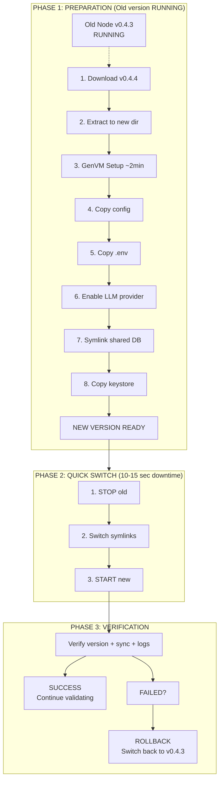

# GenLayer Validator Zero-Downtime Update Procedure

## Goal
Minimize validator downtime during updates by preparing the new version while the old version continues running.

## Process Overview



**Downtime comparison:**
- OLD WAY: STOP → Download → Extract → GenVM → START = **3-4 minutes**
- NEW WAY: [Prepare while running] → STOP → Switch → START = **10-15 seconds**

## Update Sequence (for v0.4.x patch updates)

> **Shared commands documented in `common-procedures.md`**

### Phase 1: Preparation (Old Version Running)
All preparation steps happen WHILE the validator is actively running and validating:

```bash
# 1. Check current version
curl -s http://localhost:9153/health | jq '.node_version'

# 2-4. Download, extract, set permissions
# See: common-procedures.md -> "Download & Extract Node Software"
VERSION=v0.4.5
wget https://storage.googleapis.com/gh-af/genlayer-node/bin/amd64/${VERSION}/genlayer-node-linux-amd64-${VERSION}.tar.gz \
  -O /tmp/genlayer-node-${VERSION}.tar.gz
sudo mkdir -p /opt/genlayer-node/${VERSION}
sudo tar -xzvf /tmp/genlayer-node-${VERSION}.tar.gz \
  -C /opt/genlayer-node/${VERSION} --strip-components=1
sudo chown -R $USER:$USER /opt/genlayer-node/${VERSION}

# 5. Run GenVM setup (slow part - do while old node runs!)
# See: common-procedures.md -> "GenVM Setup"
python3 /opt/genlayer-node/${VERSION}/third_party/genvm/bin/setup.py

# 6-8. Copy config and .env from current version
sudo mkdir -p /opt/genlayer-node/${VERSION}/configs/node
sudo cp /opt/genlayer-node/configs/node/config.yaml \
  /opt/genlayer-node/${VERSION}/configs/node/config.yaml
sudo cp /opt/genlayer-node/.env /opt/genlayer-node/${VERSION}/.env

# 9a. Apply LLM strategy
# See: common-procedures.md -> "LLM Strategy Selection"
sudo cp /opt/genlayer-node/${VERSION}/third_party/genvm/config/genvm-modules-llm-release.yaml \
  /opt/genlayer-node/${VERSION}/third_party/genvm/config/genvm-module-llm.yaml
# If greybox strategy (check current config to preserve existing choice):
grep -q 'genvm-llm-greybox.lua' /opt/genlayer-node/third_party/genvm/config/genvm-module-llm.yaml && \
  sudo sed -i 's/genvm-llm-default\.lua/genvm-llm-greybox.lua/' \
    /opt/genlayer-node/${VERSION}/third_party/genvm/config/genvm-module-llm.yaml

# 9b. Enable LLM provider
# See: common-procedures.md -> "Enable LLM Provider"
sudo sed -i '/^  <provider>:/,/^  [a-z]/ s/enabled: false/enabled: true/' \
  /opt/genlayer-node/${VERSION}/third_party/genvm/config/genvm-module-llm.yaml

# 10-11. Create data dir and symlink to shared database
sudo mkdir -p /opt/genlayer-node/${VERSION}/data/node
ln -s /opt/genlayer-node/v0.4/data/node/genlayer.db \
  /opt/genlayer-node/${VERSION}/data/node/genlayer.db

# 12. Copy keystore
sudo cp -r /opt/genlayer-node/data/node/keystore \
  /opt/genlayer-node/${VERSION}/data/node/
```

**At this point, everything is ready for the new version.**

### Phase 2: Quick Switch (Minimize Downtime)
Now we do the fastest possible switch:

```bash
# 1. Stop old version
sudo systemctl stop genlayer-node

# 2. Update symlinks (very fast - <1 second)
# See: common-procedures.md -> "Setup Symlinks"
cd /opt/genlayer-node
ln -sfn /opt/genlayer-node/${VERSION}/bin bin
ln -sfn /opt/genlayer-node/${VERSION}/third_party third_party
ln -sfn /opt/genlayer-node/${VERSION}/data data
ln -sfn /opt/genlayer-node/${VERSION}/configs configs
ln -sfn /opt/genlayer-node/${VERSION}/docker-compose.yaml docker-compose.yaml
ln -sfn /opt/genlayer-node/${VERSION}/.env .env
ln -sfn /opt/genlayer-node/${VERSION}/alloy-config.river alloy-config.river
ln -sfn /opt/genlayer-node/${VERSION}/genvm-module-web-docker.yaml genvm-module-web-docker.yaml

# 3. Start new version immediately
sudo systemctl start genlayer-node

# 4. Refresh Alloy telemetry bind mount (CRITICAL for monitoring)
# See: sharp-edges.yaml -> "alloy-stale-bind-mount"
# The Alloy container's bind mount becomes stale when symlinks change.
# Without this restart, Alloy stops sending logs to Grafana.
sleep 5  # Wait for node to initialize
docker restart genlayer-node-alloy 2>/dev/null || true

# Total downtime: 10-15 seconds (Alloy restart is async)
```

> **IMPORTANT**: The Alloy restart is critical! Without it, the telemetry container
> continues reading from the old log path (stale bind mount) and your validator
> will appear offline to monitoring systems, potentially leading to penalties.
> See `sharp-edges.yaml` -> `alloy-stale-bind-mount` for details.

### Phase 3: Verification

> **See `common-procedures.md` -> "Verification Commands"**

```bash
# Check version
curl -s http://localhost:9153/health | jq '.node_version'

# Check sync status
curl -s http://localhost:9153/health | jq '.checks.validating'

# Monitor logs
sudo journalctl -u genlayer-node -f --no-hostname

# Verify Alloy telemetry is working (CRITICAL)
# Check that Alloy sees the current log file (timestamp should be recent)
echo "=== Alloy bind mount check ==="
echo "Host log file:"
ls -la /opt/genlayer-node/data/node/logs/node.log 2>/dev/null | awk '{print $6, $7, $8, $9}'
echo "Alloy container view:"
docker exec genlayer-node-alloy ls -la /var/log/genlayer/node.log 2>/dev/null | awk '{print $6, $7, $8, $9}'
# Both timestamps should match! If they differ, Alloy has a stale bind mount.

# Check Alloy is actively tailing logs
docker logs genlayer-node-alloy 2>&1 | tail -3
```

> **WARNING**: If the host and container timestamps don't match, run:
> `docker restart genlayer-node-alloy`
> See `sharp-edges.yaml` -> `alloy-stale-bind-mount` for details.

## For Major Version Updates (e.g., v0.4.x -> v0.5.x)

Major version updates may require:
1. New shared storage directory (e.g., `/opt/genlayer-node/v0.5/`)
2. Database migration scripts
3. Configuration format changes

The principle remains: **Prepare everything first, then quick switch.**

## Downtime Comparison

| Method | Downtime | Validation Loss |
|--------|----------|-----------------|
| **Old way (stop first)** | 3-4 minutes | High - missed many validation rounds |
| **New way (prepare first)** | 10-15 seconds | Minimal - maybe 1 validation round |

## Key Principles

1. **Never stop the old node until the new node is 100% ready to start**
2. **GenVM setup is the slowest part** - do it while old node runs
3. **Shared database** - instant access to current sync state
4. **Symlink switching** - takes <1 second
5. **Test the new version setup** - verify files exist before switching

## Rollback Procedure (if new version fails)

If the new version fails to start:

```bash
# 1. Stop failed new version
sudo systemctl stop genlayer-node

# 2. Switch symlinks back to old version
cd /opt/genlayer-node
ln -sfn /opt/genlayer-node/v0.4.3/bin bin
ln -sfn /opt/genlayer-node/v0.4.3/third_party third_party
ln -sfn /opt/genlayer-node/v0.4.3/data data
ln -sfn /opt/genlayer-node/v0.4.3/configs configs
ln -sfn /opt/genlayer-node/v0.4.3/docker-compose.yaml docker-compose.yaml
ln -sfn /opt/genlayer-node/v0.4.3/.env .env
ln -sfn /opt/genlayer-node/v0.4.3/alloy-config.river alloy-config.river
ln -sfn /opt/genlayer-node/v0.4.3/genvm-module-web-docker.yaml genvm-module-web-docker.yaml

# 3. Start old version
sudo systemctl start genlayer-node

# 4. Refresh Alloy telemetry (same reason as upgrade)
sleep 5
docker restart genlayer-node-alloy 2>/dev/null || true

# Total rollback time: 10-15 seconds
```

## Pre-Update Checklist

Before starting any update:

- [ ] Current node is running and synced
- [ ] Disk space available (check with `df -h`)
- [ ] Backup current .env and config.yaml
- [ ] Know the rollback procedure
- [ ] Have monitoring ready to check after switch
- [ ] Note current synced block number
