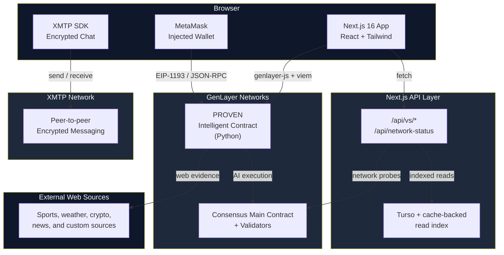
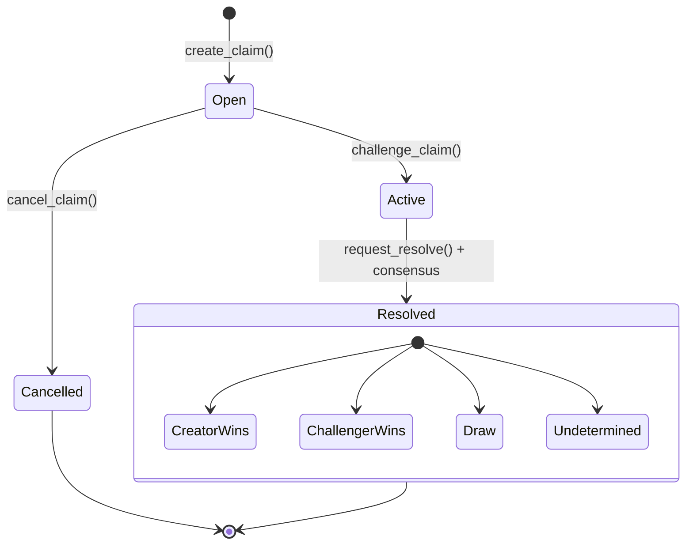
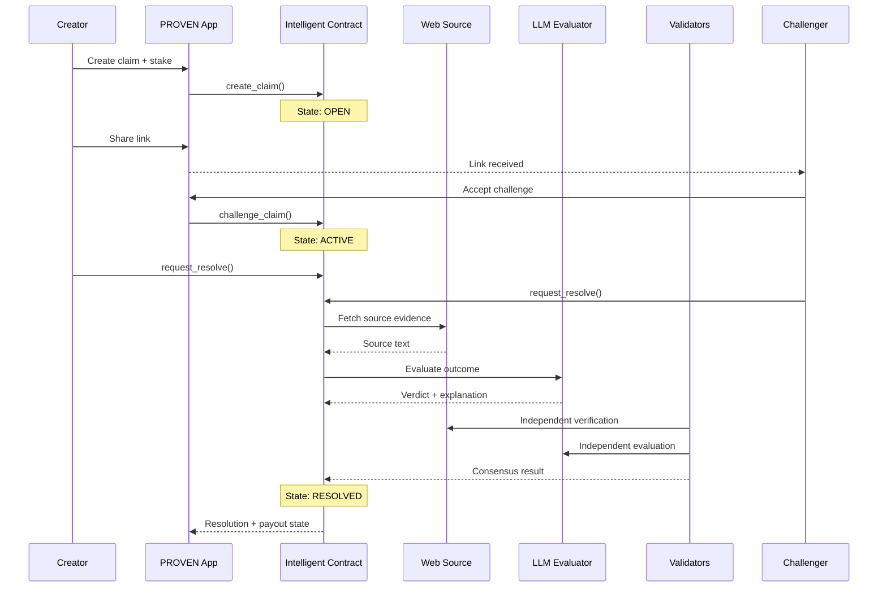
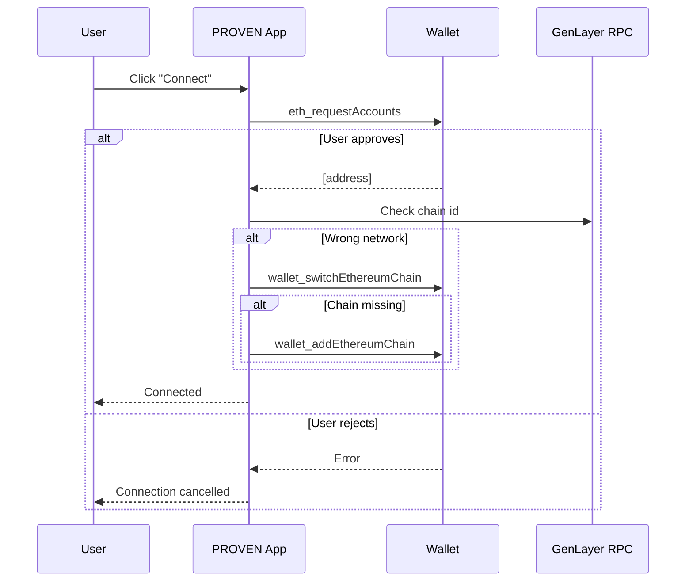

<div align="center">

# PROVEN.

**AI-settled prediction markets where the contract reads the web, judges the outcome, and settles the duel automatically.**


[Quick Start](#quick-start) | [Architecture](#architecture--highlights) | [API Reference](#api-endpoints) | [Security Model](#security-model)

---

</div>

## Table of Contents

- [Overview](#overview)
- [Core Features](#core-features)
- [Architecture / Highlights](#architecture--highlights)
- [How It Works](#how-it-works)
  - [Claim Lifecycle](#claim-lifecycle)
  - [Core Flow](#core-flow)
  - [Wallet Authentication](#wallet-authentication)
- [Quick Start](#quick-start)
  - [Prerequisites](#prerequisites)
  - [Automated Setup](#automated-setup)
  - [Start the Application](#start-the-application)
  - [Manual Setup](#manual-setup)
  - [Connect Your Wallet](#connect-your-wallet)
- [Project Structure](#project-structure)
- [API Endpoints](#api-endpoints)
- [Environment Variables](#environment-variables)
- [Technology Stack](#technology-stack)
- [Security Model](#security-model)
- [Deployment](#deployment)
  - [Deploy the Smart Contract](#deploy-the-smart-contract)
  - [Deploy the Frontend](#deploy-the-frontend)
- [Developer documentation](#developer-documentation)

---

## Developer documentation

- **[XMTP integration](docs/xmtp-integration.md)** - XMTP setup, feature flags, provider wiring, and the Messages / VS chat flow.
- **[AGENTS.md](AGENTS.md)** - repo-specific GenLayer workflow rules, contract workflow guidance, and known Bradbury caveats.

---

## Overview

PROVEN is an AI-settled claim market built on GenLayer. Users create verifiable predictions about real-world outcomes - sports, crypto, weather, culture, and custom claims - stake on their position, and challenge an opponent to a head-to-head market. When the deadline arrives, the intelligent contract fetches evidence from the web, an LLM evaluates it, and validators reach consensus through GenLayer.

The current main workflow is aligned to [`contracts/proven.py`](contracts/proven.py). Experimental contract variants can exist in the repo, but `contracts/proven.py` should be treated as the source of truth for the app, scripts, and normal deployment flow unless explicitly stated otherwise.

### The Problem

- Traditional betting platforms rely on centralized operators to define outcomes, custody funds, and settle disputes
- Existing prediction markets usually depend on separate oracle layers that are costly, constrained, or slow to adapt
- Casual peer-to-peer bets have no credible enforcement mechanism
- Verifying many kinds of real-world claims requires custom settlement logic, web evidence handling, and judgment infrastructure

### PROVEN solves this

By leveraging GenLayer intelligent contracts, PROVEN turns the contract itself into the judge. The contract reads web evidence, evaluates it against the exact market terms, and settles based on validator consensus - without relying on a custom oracle committee for each market.

---

## Core Features

### Head-to-Head Challenges

The current product experience is built around 1v1 prediction markets: a creator opens a claim and a single rival challenges it.

### AI-Powered Resolution

The contract fetches web data from the provided source URL and evaluates it against the claim terms using GenLayer AI execution.

### Consensus-Based Settlement

Validators independently execute the resolution logic and compare results under an equivalence principle, producing a consensus-backed outcome.

### Multiple Market Types

Support for binary, moneyline, spread, total, prop, and custom market structures with claim-specific settlement rules.

### Public and Private Claims

Claims can be public or invite-only. Private claims require the invite key for viewing and participation.

### Runtime Network Switching

The header includes a network switcher so users can move between configured GenLayer environments at runtime without changing code or rebuilding the app.

### Studio-Safe Demo Flow

On Studio and localnet, the app treats stake values as logical/demo values in the browser flow and avoids native token transfer value on write requests.

### XMTP 1v1 Chat

When enabled, accepted participants can message each other via XMTP, and the Messages hub aggregates active conversations across claims.

### Network-Aware Read Paths

Bradbury uses the indexed feed and cache-backed API routes, while non-Bradbury browser views read directly from the selected contract to avoid mixing claims across networks.

### Dashboard and Arena Views

The app includes an arena-style public explorer plus a user dashboard for active, pending, and resolved markets.

---

## Architecture / Highlights



### Trust Boundaries

| Boundary | Trust Level | Verification Mechanism |
| --- | --- | --- |
| User to Frontend | Untrusted | Wallet approval for state-changing actions |
| Frontend to Contract | Authenticated | Transactions are signed through the connected wallet |
| Contract to Web Sources | Semi-trusted | Validators independently fetch and evaluate evidence |
| AI Verdict | Consensus-verified | Validator consensus and equivalence comparison |
| Read Index to Contract | Internal | Index is derived convenience data, not source of truth |

---

## How It Works

### Claim Lifecycle



### Core Flow



### Wallet Authentication

MetaMask or another injected EIP-1193 wallet is the primary browser auth path. The app connects the wallet, verifies the selected network, and can prompt the wallet to switch to the configured GenLayer chain.



The runtime network switcher also uses this flow when the user changes networks from the header.

---

## Quick Start

> Hackathon MVP - production hardening is still ongoing.

### Prerequisites

- [Node.js 18+](https://nodejs.org/)
- npm
- [MetaMask](https://metamask.io/) or another injected wallet
- Access to GenLayer Studio or Bradbury

### Automated Setup

```bash
git clone https://github.com/pxrsival/proven-app.git
cd proven-app
npm install
cp .env.example .env.local
```

### Start the Application

```bash
npm run dev
```

| Service | URL |
| --- | --- |
| Frontend | http://localhost:3000 |
| English | http://localhost:3000/en |
| Spanish | http://localhost:3000/es |

If you hit stale dev chunks:

```bash
npm run dev:clean
```

### Manual Setup

1. Clone the repository.
2. Install dependencies with `npm install`.
3. Copy `.env.example` to `.env.local`.
4. Set your base network and contract env vars.
5. Start the app with `npm run dev`.

Example Studio-first setup:

```env
NEXT_PUBLIC_GENLAYER_NETWORK=studionet
GENLAYER_NETWORK=studionet
NEXT_PUBLIC_GENLAYER_RPC=https://studio.genlayer.com/api
GENLAYER_RPC=https://studio.genlayer.com/api
NEXT_PUBLIC_CONTRACT_ADDRESS=0xYOUR_STUDIO_CONTRACT
NEXT_PUBLIC_CONTRACT_ADDRESS_STUDIONET=0xYOUR_STUDIO_CONTRACT
NEXT_PUBLIC_CONTRACT_ADDRESS_TESTNET_BRADBURY=0xYOUR_BRADBURY_CONTRACT
```

### Connect Your Wallet

1. Install MetaMask if you have not already.
2. Click `Connect` in the app header.
3. Approve the wallet connection.
4. If needed, let the wallet switch to the selected GenLayer network.
5. Use the header network chip to move between configured environments.

Notes:

- On Studio/localnet, browser writes intentionally send `value = 0`.
- On Bradbury, the app uses the Bradbury-compatible write flow and indexed read path.

---

## Project Structure

```text
proven-app/
|-- app/
|   |-- [locale]/
|   |   |-- dashboard/
|   |   |-- explorer/
|   |   |-- messages/
|   |   `-- vs/
|   `-- api/
|       |-- challenge-opportunities/
|       |-- cron/
|       |-- network-status/
|       `-- vs/
|-- components/
|   |-- dashboard/
|   |-- layout/
|   |-- ui/
|   `-- xmtp/
|-- contracts/
|   |-- proven.py
|   `-- proven_oracle_v2.py
|-- deploy/
|   `-- deploy.ts
|-- docs/
|-- hooks/
|-- lib/
|   |-- contract.ts
|   |-- genlayer.ts
|   |-- wallet.tsx
|   |-- server/
|   `-- xmtp/
|-- messages/
|-- scripts/
|-- tests/
|-- AGENTS.md
`-- gltest.config.yaml
```

---

## API Endpoints

Claim data is served through the API layer, but the exact read path depends on the network:

- Bradbury browser views use the indexed API and cache-backed read model
- Studio/local non-Bradbury browser views bypass the shared index and read directly from the selected contract

Core endpoints:

| Method | Path | Description | Auth |
| --- | --- | --- | --- |
| GET | `/api/vs` | List public VS claims. `?refresh=1` forces a refresh attempt. | None |
| GET | `/api/vs/[id]` | Get a single VS claim. Supports `?invite=KEY` for private claims. | Invite key for private claims |
| GET | `/api/vs/user/[address]` | Get claims where the address is a participant. | None |
| GET | `/api/network-status` | Probe a target network. Supports `?network=studionet`, `?network=testnet-bradbury`, etc. | None |
| GET | `/api/challenge-opportunities` | Returns challenge opportunity suggestions. | None |
| POST | `/api/cron/sync` | Triggers indexed sync workflow. | `CRON_SECRET` |
| POST | `/api/cron/challenge-opportunities` | Refreshes challenge opportunity data. | `CRON_SECRET` |

---

## Environment Variables

| Variable | Description | Default / Notes |
| --- | --- | --- |
| `NEXT_PUBLIC_CONTRACT_ADDRESS` | Base contract address | Used for the base env network |
| `NEXT_PUBLIC_CONTRACT_ADDRESS_STUDIONET` | Studio contract address | Used when Studio is selected |
| `NEXT_PUBLIC_CONTRACT_ADDRESS_TESTNET_BRADBURY` | Bradbury contract address | Used when Bradbury is selected |
| `NEXT_PUBLIC_CONTRACT_ADDRESS_LOCALNET` | Localnet contract address | Optional |
| `NEXT_PUBLIC_CONTRACT_ADDRESS_TESTNET_ASIMOV` | Asimov contract address | Optional |
| `NEXT_PUBLIC_GENLAYER_NETWORK` | Base frontend network alias | `testnet-bradbury` if unset |
| `GENLAYER_NETWORK` | Base server network alias | Falls back to frontend/base logic |
| `NEXT_PUBLIC_GENLAYER_RPC` | Frontend RPC override | Optional |
| `GENLAYER_RPC` | Server RPC override | Optional |
| `NEXT_PUBLIC_GENLAYER_MAIN_CONTRACT` | Frontend consensus main contract override | Optional |
| `GENLAYER_MAIN_CONTRACT` | Server consensus main contract override | Optional |
| `NEXT_PUBLIC_GENLAYER_EXPLORER` | Frontend explorer override | Optional |
| `GENLAYER_EXPLORER` | Server explorer override | Optional |
| `NEXT_PUBLIC_FEATURE_XMTP` | Enables XMTP UI | Truthy string enables it |
| `NEXT_PUBLIC_XMTP_ENV` | XMTP environment | `dev` by app default |
| `NEXT_PUBLIC_XMTP_APP_VERSION` | XMTP telemetry/app id | Optional |
| `NEXT_PUBLIC_FEATURE_SOURCE_DRAFTS` | Enables source drafting UI | Optional |
| `TURSO_DATABASE_URL` | Turso/libSQL database URL | Server-only |
| `TURSO_AUTH_TOKEN` | Turso auth token | Server-only |
| `CRON_SECRET` | Protects cron endpoints | Server-only |
| `GEMINI_API_KEY` | Claim drafting API key | Server-only |
| `CLAIM_DRAFT_MODEL` | Claim drafting model override | Defaults to `gemini-2.5-flash` |
| `NEXT_PUBLIC_FEATURE_CLAIM_MODERATION` | Enables claim moderation gate in create flow | Optional |
| `CLAIM_MODERATION_MODEL` | Claim moderation model override | Defaults to `gemini-2.5-flash` |

All `NEXT_PUBLIC_*` variables are exposed to the browser. Use [`.env.example`](.env.example) as the safe starting template.

---

## Technology Stack

### Frontend

| Layer | Technology |
| --- | --- |
| Framework | Next.js 16 (App Router) |
| UI Library | React 18 |
| Language | TypeScript 5 |
| Styling | Tailwind CSS 3.4 |
| Animations | Framer Motion |
| Icons | Lucide React |
| Notifications | Sonner |
| Internationalization | next-intl |
| Messaging | XMTP Browser SDK v7 |

### Blockchain

| Layer | Technology |
| --- | --- |
| Contract runtime | GenLayer Intelligent Contract (Python) |
| Main contract workflow | `contracts/proven.py` |
| Client SDK | `genlayer-js` + `viem` |
| Networks | Studio, Bradbury, localnet, Asimov-aware config |
| Consensus | GenLayer validator consensus |
| Wallet | MetaMask / injected EIP-1193 wallet |

### Infrastructure

| Layer | Technology |
| --- | --- |
| Hosting | Vercel-friendly Next.js app |
| API Layer | Next.js Route Handlers |
| Indexed reads | Turso/libSQL + `.cache` snapshots |
| Build Tool | Next.js |
| Package Manager | npm |

---

## Security Model

### Key Security Properties

| Property | Implementation |
| --- | --- |
| Contract is source of truth | UI convenience layers do not replace onchain claim state |
| Write authorization | State-changing actions require wallet-signed transactions |
| Private claim access | Invite key gated reads and participation for private markets |
| Network separation in browser views | Non-Bradbury runtime selections bypass the shared indexed feed |
| Indexed cache is derived only | API index is a read model, not canonical settlement state |
| Wallet network safety | App checks the active chain before browser writes |

### Attack Resistance

| Attack Vector | Status | Mechanism |
| --- | --- | --- |
| Unauthorized write actions | Mitigated | Wallet-signed writes only |
| Wrong-network browser actions | Mitigated | Header status + wallet network checks |
| Cross-network claim leakage in client views | Mitigated | Direct non-Bradbury reads from the selected contract |
| Stale indexed reads | Reduced | Refresh path plus direct contract fallback where needed |
| Secret exposure in repo | Developer responsibility | Do not commit `.env.local`; rotate leaked credentials |

---

## Deployment

### Deploy the Smart Contract

#### Option A: GenLayer Studio

Fastest path for demos:

1. Deploy the contract to Studio.
2. Copy the Studio contract address.
3. Set:

```env
NEXT_PUBLIC_CONTRACT_ADDRESS=0xYOUR_STUDIO_CONTRACT
NEXT_PUBLIC_CONTRACT_ADDRESS_STUDIONET=0xYOUR_STUDIO_CONTRACT
```

#### Option B: GenLayer CLI

```bash
# Bradbury deploy and write env
npm run deploy:contract

# Explicit Bradbury deploy alias
npm run deploy:contract:bradbury

# Localnet deploy
npm run deploy:contract:localnet
```

### Staged contract workflow

Use the staged workflow when you want faster validation before Bradbury deploy:

```bash
# Lint -> direct tests -> localnet -> studionet
npm run contract:stage

# Same flow, then deploy to Bradbury and update .env.local
npm run contract:stage:deploy
```

Supporting commands:

```bash
npm run contract:check
npm run test:direct
npm run test:integration:localnet
npm run test:integration:studionet
```

#### Option C: SDK Deploy Script

```bash
export DEPLOYER_PRIVATE_KEY=0xYOUR_PRIVATE_KEY
npm run deploy:contract:sdk
```

### Deploy the Frontend

#### Vercel (recommended)

```bash
npm i -g vercel
vercel --prod
```

Important production envs for a Studio-first deployment:

```env
NEXT_PUBLIC_GENLAYER_NETWORK=studionet
GENLAYER_NETWORK=studionet
NEXT_PUBLIC_GENLAYER_RPC=https://studio.genlayer.com/api
GENLAYER_RPC=https://studio.genlayer.com/api
NEXT_PUBLIC_CONTRACT_ADDRESS=0xYOUR_STUDIO_CONTRACT
NEXT_PUBLIC_CONTRACT_ADDRESS_STUDIONET=0xYOUR_STUDIO_CONTRACT
NEXT_PUBLIC_CONTRACT_ADDRESS_TESTNET_BRADBURY=0xYOUR_BRADBURY_CONTRACT
```

If you want the runtime switcher to expose a network in production, make sure that network has a configured contract address in env.

#### Netlify

1. Import the repo at [netlify.com](https://netlify.com)
2. Use `npm run build`
3. Publish the Next.js output using the normal Next adapter path
4. Add the same network and contract env vars used locally

#### Cloudflare Pages

1. Connect the repo at [pages.cloudflare.com](https://pages.cloudflare.com)
2. Use the Next.js preset
3. Add the same network and contract env vars used locally

---

<div align="center">

**The contract reads the web. Validators judge the result. PROVEN turns that into a playable market.**

Built for Aleph Hackathon 2026 - GenLayer Track

MIT License

</div>
