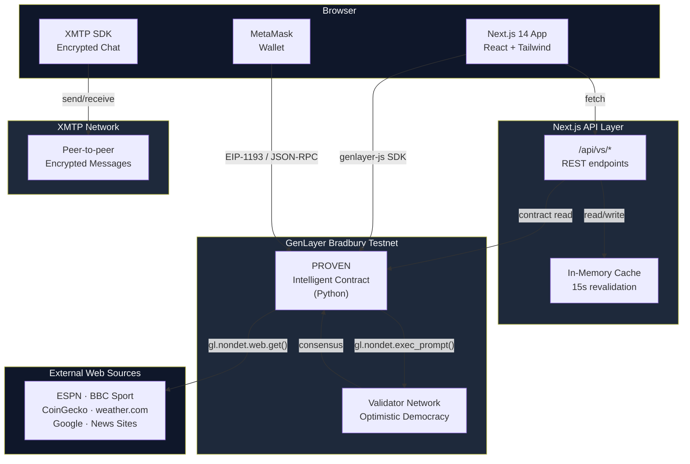
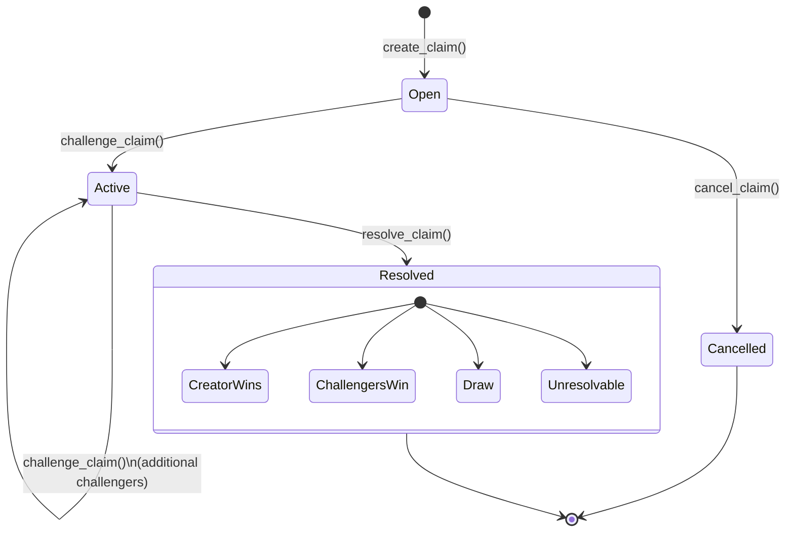
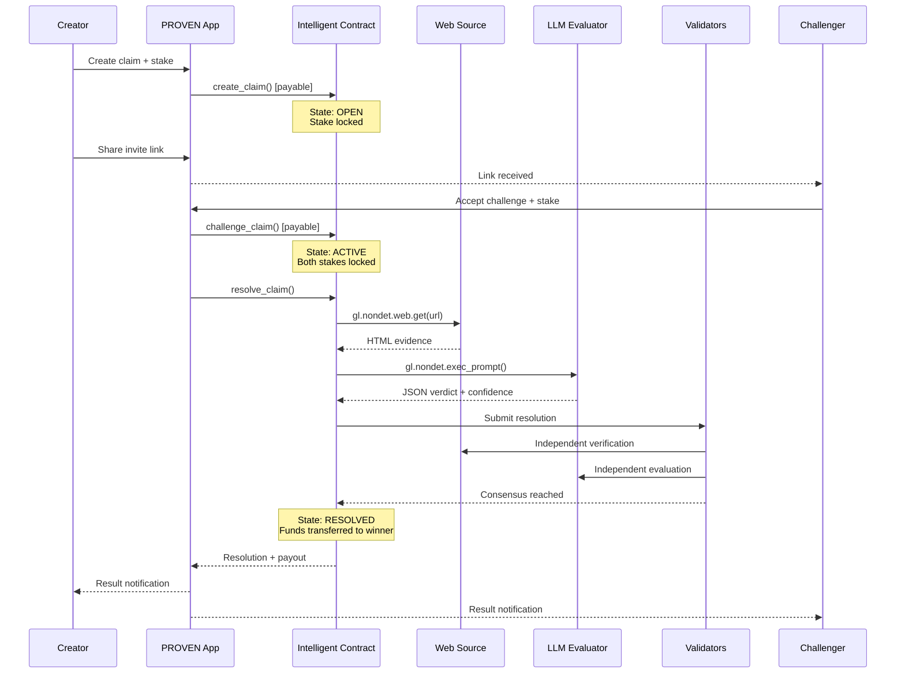
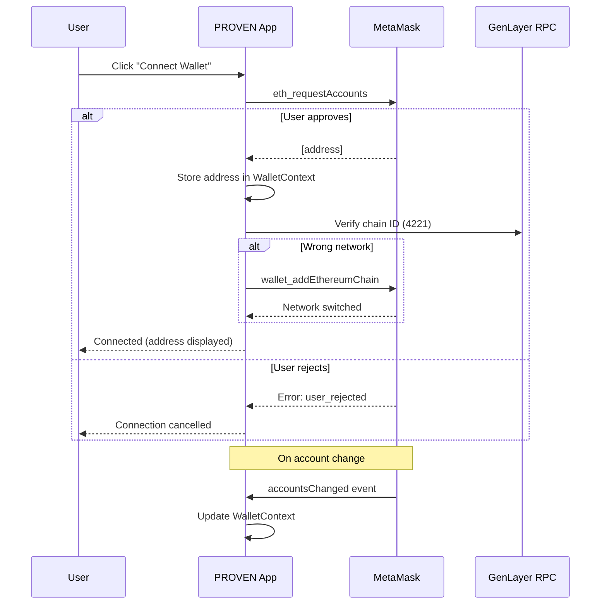

<div align="center">

# PROVEN.

**AI-settled prediction markets where the blockchain reads the web, judges the outcome, and pays the winner — automatically.**


[Quick Start](#quick-start) · [Architecture](#architecture--highlights) · [API Reference](#api-endpoints) · [Security Model](#security-model)

---

</div>

## Table of Contents

- [Overview](#overview)
- [Core Features](#core-features)
- [Architecture / Highlights](#architecture--highlights)
- [How It Works](#how-it-works)
  - [Claim Lifecycle](#claim-lifecycle)
  - [Core Flow](#core-flow)
  - [Wallet Authentication](#wallet-authentication)
- [Quick Start](#quick-start)
  - [Prerequisites](#prerequisites)
  - [Automated Setup](#automated-setup)
  - [Start the Application](#start-the-application)
  - [Manual Setup](#manual-setup)
  - [Connect Your Wallet](#connect-your-wallet)
- [Project Structure](#project-structure)
- [API Endpoints](#api-endpoints)
- [Environment Variables](#environment-variables)
- [Technology Stack](#technology-stack)
- [Security Model](#security-model)
- [Deployment](#deployment)
  - [Deploy the Smart Contract](#deploy-the-smart-contract)
  - [Deploy the Frontend](#deploy-the-frontend)
- [Developer documentation](#developer-documentation)

---

## Developer documentation

- **[XMTP integration](docs/xmtp-integration.md)** — Steps 1–7: XmtpProvider + `VsXmtpPanel` chat panel in `/vs/[id]` + Messages hub at `/messages` (list of active 1v1 conversations). Navbar shows a "Messages" chip next to "My VS" when `NEXT_PUBLIC_FEATURE_XMTP=1`. See [`.env.example`](.env.example) for configuration.

---

## Overview

PROVEN is an AI-settled claim market built on GenLayer. Users create verifiable predictions about real-world outcomes — sports, crypto, weather, culture — stake tokens on their position, and share a link for others to challenge. When the deadline arrives, the intelligent contract fetches evidence from the web, an LLM evaluates it, and multiple validators reach consensus through Optimistic Democracy. The winner is paid automatically. No oracles, no committees, no disputes.

### The Problem

- Traditional betting platforms require centralized arbiters to settle outcomes, introducing trust, fees, and delays
- Existing prediction markets need external oracle networks that are expensive to maintain and limited in what they can verify
- Peer-to-peer bets between friends have no enforcement mechanism — losers can simply refuse to pay
- Building a custom resolution pipeline for every category of verifiable claim is prohibitively complex

### PROVEN solves this

By leveraging GenLayer's intelligent contracts, PROVEN turns the blockchain itself into the judge. The contract reads real-world data, evaluates it with AI, and reaches consensus across validators — making any verifiable claim on the internet automatically settleable.

---

## Core Features

### Instant 1v1 or 1-vs-Many Challenges

Create a prediction, set your stake, and share a link. One opponent or up to 100 challengers can join a single claim.

### AI-Powered Resolution

The intelligent contract fetches live web data from the source URL you provide, then an LLM evaluates the evidence against your claim's exact terms.

### Optimistic Democracy Consensus

Multiple validators independently verify the resolution. The Equivalence Principle ensures consensus even when different AI models phrase conclusions differently.

### Multiple Market Types

Support for binary, moneyline, spread, total, prop, and custom markets — each with configurable handicap lines and settlement rules.

### Pool and Fixed Odds

Choose pool odds (pari-mutuel split based on stake proportions) or creator-backed fixed odds with explicit payout multiples.

### Rivalry Rematches

Resolved claims can spawn linked rematches, building an onchain rivalry chain between opponents with full history tracking.

### Private Invite-Only Claims

Create private challenges accessible only via a secret invite link. The claim exists onchain but is invisible to public browsing.

### XMTP 1v1 Chat

Once a challenge is accepted, creator and challenger can message each other directly via XMTP — encrypted, peer-to-peer, onchain-gated. A Messages hub shows all active conversations across your duels.

### MetaMask Wallet Login

Connect your MetaMask wallet to authenticate and sign all transactions directly on GenLayer Bradbury (Chain ID: 4221). The app auto-detects the network and prompts to add it if needed. Your address, claims, and stats are tied to your connected wallet.

### Optimistic UI

Newly created claims appear instantly in Dashboard and Explore via localStorage, with a pulsing "Pending" badge, while GenLayer consensus finalizes in the background.

### Real-Time Dashboard

Track all your active, pending, and resolved claims in one place with win/loss stats, countdowns, and instant resolution notifications.

---

## Architecture / Highlights



### Trust Boundaries

| Boundary | Trust Level | Verification Mechanism |
| --- | --- | --- |
| User to Frontend | Untrusted | MetaMask wallet signature on every write transaction |
| Frontend to Contract | Authenticated | Transactions signed by user's private key via EIP-1193 |
| Contract to Web Sources | Semi-trusted | Multiple validators independently fetch and cross-verify |
| AI Verdict | Consensus-verified | Optimistic Democracy with Equivalence Principle across validators |
| API Cache to Contract | Internal | Cache is read-only; writes always go direct to contract |

---

## How It Works

### Claim Lifecycle



### Core Flow



### Wallet Authentication

MetaMask is the primary authentication method. Users connect their wallet to sign all write transactions (create, challenge, resolve, cancel) directly on GenLayer Bradbury.



When a wallet is connected, all write operations are signed by the user's private key via EIP-1193. The Dashboard shows claims where the connected address is creator or challenger, and win/loss stats are calculated from the user's onchain history.


---

## Quick Start

> **Hackathon MVP** — This project was built for the Aleph Hackathon 2026 (GenLayer Track). Production hardening is in progress.

### Prerequisites

- [Node.js 18+](https://nodejs.org/)
- npm (included with Node.js)
- [MetaMask](https://metamask.io/) browser extension
- GenLayer Bradbury testnet tokens ([get from Discord faucet](https://discord.gg/8Jm4v89VAu))

### Automated Setup

```bash
git clone https://github.com/pxrsival/proven-app.git
cd proven-app && npm install
```

### Start the Application

```bash
npm run dev
```

| Service | URL |
| --- | --- |
| Frontend | http://localhost:3000 |
| Default locale | http://localhost:3000/es |

If you encounter chunk errors in dev mode, start with a clean cache:

```bash
npm run dev:clean
```

### Manual Setup

1. Clone the repository:

```bash
git clone https://github.com/pxrsival/proven-app.git
cd proven-app
```

2. Install dependencies:

```bash
npm install
```

3. Configure environment:

```bash
echo "NEXT_PUBLIC_CONTRACT_ADDRESS=0xYOUR_ADDRESS" > .env.local
```

4. Start the development server:

```bash
npm run dev
```

5. Open http://localhost:3000 in your browser.

### Connect Your Wallet

1. Install MetaMask if you haven't already
2. Click "Connect Wallet" in the app header
3. Approve the connection in MetaMask
4. If prompted, allow the app to add the GenLayer Bradbury network (Chain ID: 4221)
5. Get testnet tokens from the [GenLayer Discord faucet](https://discord.gg/8Jm4v89VAu) or use [GenLayer Studio](https://studio.genlayer.com) test accounts

---

## Project Structure

```
proven-app/
├── app/
│   ├── layout.tsx                        # Root layout, WalletProvider, fonts, Toaster
│   ├── globals.css                       # Global styles + Tailwind directives
│   ├── icon.svg                          # App favicon
│   ├── [locale]/
│   │   ├── layout.tsx                    # Locale-aware layout with next-intl provider
│   │   ├── page.tsx                      # Landing page — hero VS + open claim previews
│   │   ├── dashboard/
│   │   │   └── page.tsx                  # User dashboard — my claims, stats, tabs
│   │   ├── explore/
│   │   │   ├── page.tsx                  # Server component — explore entry point
│   │   │   └── ExploreClient.tsx         # Client component — filters, search, grid
│   │   └── vs/
│   │       ├── create/
│   │       │   └── page.tsx              # Create VS form — market config, odds, stake
│   │       └── [id]/
│   │           └── page.tsx              # VS detail — accept, resolve, result, rematch
│   │   └── messages/
│   │       └── page.tsx                  # XMTP messages hub — all active 1v1 conversations
│   └── api/
│       └── vs/
│           ├── route.ts                  # GET /api/vs — list all public VS
│           ├── [id]/
│           │   └── route.ts              # GET /api/vs/:id — single VS with invite support
│           └── user/
│               └── [address]/
│                   └── route.ts          # GET /api/vs/user/:address — user's VS
├── components/
│   ├── Header.tsx                        # Navigation bar + wallet connection
│   ├── Footer.tsx                        # Footer links
│   ├── ArenaCard.tsx                     # Claim preview card (arena/explore view)
│   ├── VSCard.tsx                        # Claim card (dashboard view)
│   ├── Confetti.tsx                      # Win celebration animation
│   ├── ProvenStamp.tsx                   # PROVEN. stamp victory animation
│   ├── ResolutionTerminal.tsx            # Terminal-style resolution reveal
│   ├── PageTransition.tsx                # Framer Motion page transitions
│   ├── EmptyState.tsx                    # Empty results fallback
│   ├── HtmlLang.tsx                      # HTML lang attribute provider
│   ├── xmtp/
│   │   ├── VsXmtpPanel.tsx              # In-page chat panel for accepted VS
│   │   └── MessagesHub.tsx              # Messages hub — all conversations list
│   └── ui/
│       ├── Avatar.tsx                    # User avatar with address-based colors
│       ├── Badge.tsx                     # Status badge (open, active, resolved)
│       ├── Button.tsx                    # Styled button with variants
│       ├── Chip.tsx                      # Filter/tag chip
│       ├── CountdownTimer.tsx            # Live countdown to deadline
│       ├── GlassCard.tsx                 # Glassmorphism card container
│       ├── Input.tsx                     # Styled input field
│       ├── PoolBadge.tsx                 # Total pot display badge
│       ├── Skeleton.tsx                  # Loading skeleton
│       ├── VSStrip.tsx                   # Compact VS preview strip
│       └── index.ts                     # Barrel exports
├── contracts/
│   └── proven.py                         # GenLayer intelligent contract (882 lines)
├── deploy/
│   └── deploy.ts                         # SDK-based deploy script (private key)
├── hooks/
│   ├── useExploreFilterState.ts          # URL-synced filter state for explore page
├── i18n/
│   ├── routing.ts                        # Locale config (es, en) + prefix strategy
│   ├── request.ts                        # Server-side locale message loader
│   └── navigation.ts                     # Locale-aware Link and navigation helpers
├── lib/
│   ├── contract.ts                       # Typed contract interface + VS mapping
│   ├── genlayer.ts                       # GenLayer client factory + chain config
│   ├── wallet.tsx                        # WalletProvider React context
│   ├── constants.ts                      # Categories, prefills, guidance text
│   ├── hooks.ts                          # useCountdown hook
│   ├── fonts.ts                          # Custom font loading
│   ├── exploreFilters.ts                 # Filter type definitions
│   ├── pending-vs.ts                     # Optimistic pending VS store (localStorage)
│   ├── private-links.ts                  # Private invite key generation + storage
│   ├── xmtp/                             # XMTP messaging integration
│   │   ├── XmtpProvider.tsx              # XMTP client context provider
│   │   ├── config.ts                     # XMTP env + feature flag helpers
│   │   ├── signer.ts                     # Wallet-to-XMTP signer bridge
│   │   ├── chat-thread.ts               # Chat thread creation + message handling
│   │   ├── optimistic-send.ts           # Optimistic message display
│   │   ├── vs-chat-eligibility.ts       # Chat eligibility rules (accepted claims only)
│   │   ├── types.ts                      # XMTP type definitions
│   │   └── index.ts                      # Barrel exports
│   └── server/
│       ├── vs-cache.ts                   # Server-side in-memory cache layer
├── messages/
│   ├── en.json                           # English translations (310 keys)
│   └── es.json                           # Spanish translations (310 keys)
├── public/
│   └── icons/                            # SVG icons (handshake, chat, users)
├── scripts/
│   ├── genlayer-deploy.mjs               # CLI deploy wrapper
│   └── warm-vs-index.ts                  # Pre-warm cache script
├── proxy.ts                               # next-intl locale routing proxy
├── next.config.js                        # Next.js config with next-intl plugin
├── tailwind.config.ts                    # Custom theme (colors, animations, fonts)
├── tsconfig.json                         # TypeScript strict mode config
├── gltest.config.yaml                    # GenLayer network config (localnet/bradbury)
└── package.json                          # Dependencies + scripts
```

---

## API Endpoints

Claim data is public onchain. Private claims require an `invite` query parameter.

| Method | Path | Description | Auth |
| --- | --- | --- | --- |
| GET | `/api/vs` | List all public VS claims. Pass `?refresh=1` to force cache rebuild. | None |
| GET | `/api/vs/[id]` | Get a single VS by ID. Pass `?invite=KEY` for private claims. | Invite key (private only) |
| GET | `/api/vs/user/[address]` | Get all VS where the address is creator or challenger. | None |

Response headers include `Cache-Control: public, s-maxage=15, stale-while-revalidate=60` for public endpoints. Private claim responses use `Cache-Control: private, no-store`.

---

## Environment Variables

| Variable | Description | Default |
| --- | --- | --- |
| `NEXT_PUBLIC_CONTRACT_ADDRESS` | Deployed PROVEN contract address | `0x000...000` |
| `NEXT_PUBLIC_GENLAYER_RPC` | GenLayer RPC endpoint (overrides default) | `https://rpc-bradbury.genlayer.com` |
| `NEXT_PUBLIC_GENLAYER_MAIN_CONTRACT` | Consensus main contract address | `0x0112Bf6e83497965A5fdD6Dad1E447a6E004271D` |
| `NEXT_PUBLIC_XMTP_ENV` | XMTP network: `local`, `dev`, or `production` | `dev` (in-app default if unset) |
| `NEXT_PUBLIC_FEATURE_XMTP` | Enable XMTP UI when `1`, `true`, or `yes` | disabled if unset |
| `NEXT_PUBLIC_XMTP_APP_VERSION` | App id for XMTP telemetry (e.g. `proven-app/1.0.0`) | `proven-app/0.1` |
| `GENLAYER_RPC` | Server-side RPC override (not exposed to browser) | Same as public default |
| `GENLAYER_MAIN_CONTRACT` | Server-side consensus contract override | Same as public default |
| `TURSO_DATABASE_URL` | Turso/libSQL database URL for the disposable read index | Unset |
| `TURSO_AUTH_TOKEN` | Turso auth token for the read index | Unset |
| `CRON_SECRET` | Bearer token protecting `/api/cron/sync` | Unset |

All `NEXT_PUBLIC_*` variables are exposed to the browser. Server-only variables are used by API routes and build scripts.

See [`.env.example`](.env.example) for a commented template and [`docs/xmtp-integration.md`](docs/xmtp-integration.md) for the XMTP rollout plan.

---

## Technology Stack

### Frontend

| Layer | Technology |
| --- | --- |
| Framework | Next.js 14 (App Router) |
| UI Library | React 18 |
| Language | TypeScript 5 (strict mode) |
| Styling | Tailwind CSS 3.4 |
| Animations | Framer Motion 12 |
| Icons | Lucide React |
| Notifications | Sonner |
| Internationalization | next-intl 3.26 (ES + EN) |
| Loading Bar | nextjs-toploader |
| Messaging | XMTP Browser SDK v7 (encrypted peer-to-peer chat) |

### Blockchain

| Layer | Technology |
| --- | --- |
| Smart Contract | GenLayer Intelligent Contract (Python) |
| Network | GenLayer Bradbury Testnet (Chain ID: 4221) |
| Consensus | Optimistic Democracy + Equivalence Principle |
| Web Verification | `gl.nondet.web.get()` — real-time web fetch |
| AI Evaluation | `gl.nondet.exec_prompt()` — LLM verdict |
| Client SDK | genlayer-js 0.23 |
| Wallet | MetaMask (EIP-1193) |

### Infrastructure

| Layer | Technology |
| --- | --- |
| Hosting | Vercel (recommended) |
| API Layer | Next.js API Routes (serverless) |
| Caching | In-memory JSON cache with 15s revalidation |
| Build Tool | Next.js (Webpack) |
| Package Manager | npm |

---

## Security Model

For full details, see the [implementation checklist](implementation-checklist.md) and [deep research report](deep-research-report.md).

### Key Security Properties

| Property | Implementation |
| --- | --- |
| Stake custody | Funds held by the contract — non-custodial, no intermediary |
| Write authorization | Every state-changing call requires a wallet-signed transaction |
| Self-challenge prevention | Contract rejects `challenge_claim()` if sender equals creator |
| Duplicate challenge prevention | Contract checks all existing challengers before accepting |
| Minimum stake enforcement | All stakes must be >= 2 tokens (prevents dust spam) |
| Fixed-odds liability cap | Creator liability is reserved upfront; challengers cannot exceed available liquidity |
| Private claim access | Invite key required for both viewing and challenging private claims |
| Resolution integrity | Multiple validators independently fetch web data and evaluate — consensus required |
| Cancel safety | Only the creator can cancel, and only before any challenger joins |

### Attack Resistance

| Attack Vector | Status | Mechanism |
| --- | --- | --- |
| Unauthorized fund withdrawal | ✅ Mitigated | Only contract logic triggers transfers; no external withdraw function |
| Self-dealing / wash trading | ✅ Mitigated | Creator cannot challenge their own claim |
| Stake manipulation | ✅ Mitigated | `gl.message.value` must exactly equal declared stake amount |
| Oracle manipulation | ✅ Mitigated | Multi-validator independent verification via Optimistic Democracy |
| Private claim enumeration | ✅ Mitigated | Private claims excluded from all public list endpoints |
| Challenger overflow | ✅ Mitigated | Hard cap of 100 challengers per claim enforced by contract |
| Resolution before event | ✅ Mitigated | AI returns UNRESOLVABLE if evidence is insufficient |

---

## Deployment

### Deploy the Smart Contract

#### Option A: GenLayer Studio (fastest)

1. Open [studio.genlayer.com](https://studio.genlayer.com)
2. Paste the contents of `contracts/proven.py`
3. Deploy — copy the resulting contract address
4. Set the address in `.env.local`:

```bash
echo "NEXT_PUBLIC_CONTRACT_ADDRESS=0xYOUR_ADDRESS" > .env.local
```

#### Option B: GenLayer CLI

```bash
# Deploy to default network (Bradbury)
npm run deploy:contract

# Force Bradbury network
npm run deploy:contract:bradbury

# Deploy and auto-update .env.local
npm run deploy:contract:env
```

### Staged contract workflow

Use the staged workflow when you want to gate Bradbury behind faster checks first:

```bash
# 1. Lint -> direct tests -> localnet -> studionet
npm run contract:stage

# 2. Same flow, then deploy to Bradbury
npm run contract:stage:deploy
```

Supporting commands:

```bash
npm run contract:check
npm run test:direct
npm run test:integration:localnet
npm run test:integration:studionet
```

The staged workflow uses:
- `genvm-lint` for structural contract validation
- direct tests for the fastest feedback loop
- integration smoke tests on `localnet` and `studionet`
- Bradbury only as the final deploy stage

#### Option C: SDK Deploy Script

```bash
export DEPLOYER_PRIVATE_KEY=0xYOUR_PRIVATE_KEY
npm run deploy:contract:sdk
```

#### Getting Testnet Tokens

Join the [GenLayer Discord](https://discord.gg/8Jm4v89VAu) and use the `#faucet` channel, or use GenLayer Studio which provides test accounts with pre-funded tokens.

### Deploy the Frontend

#### Vercel (recommended)

```bash
npm i -g vercel
vercel --prod
```

Or import the GitHub repo at [vercel.com](https://vercel.com) and add `NEXT_PUBLIC_CONTRACT_ADDRESS` as an environment variable.

#### Netlify

1. Import repo at [netlify.com](https://netlify.com)
2. Build command: `npm run build`
3. Publish directory: `.next`
4. Add env var: `NEXT_PUBLIC_CONTRACT_ADDRESS`

#### Cloudflare Pages

1. Connect repo at [pages.cloudflare.com](https://pages.cloudflare.com)
2. Framework preset: Next.js
3. Add env var: `NEXT_PUBLIC_CONTRACT_ADDRESS`

---


<div align="center">

**The blockchain reads the web. AI judges the outcome. The winner gets paid. That's PROVEN.**

Built for [Aleph Hackathon 2026](https://aleph.crecimiento.build) — GenLayer Track + PL_Genesis

MIT License

</div>
